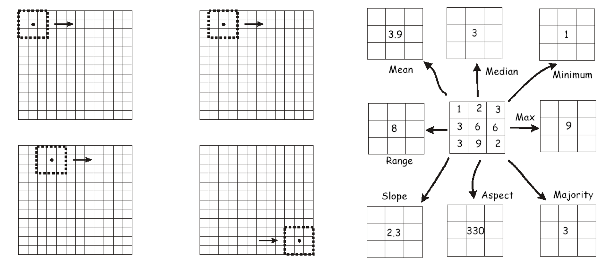
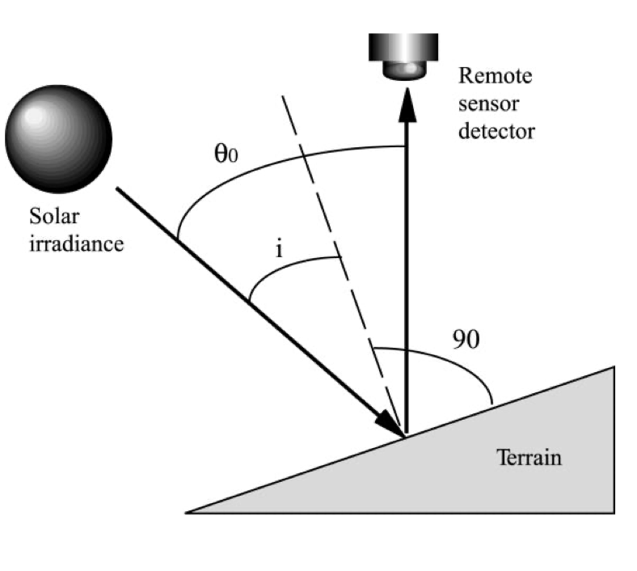
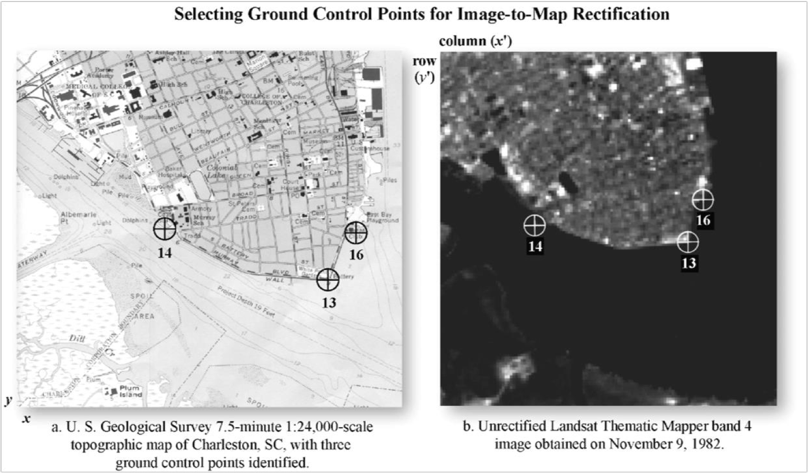
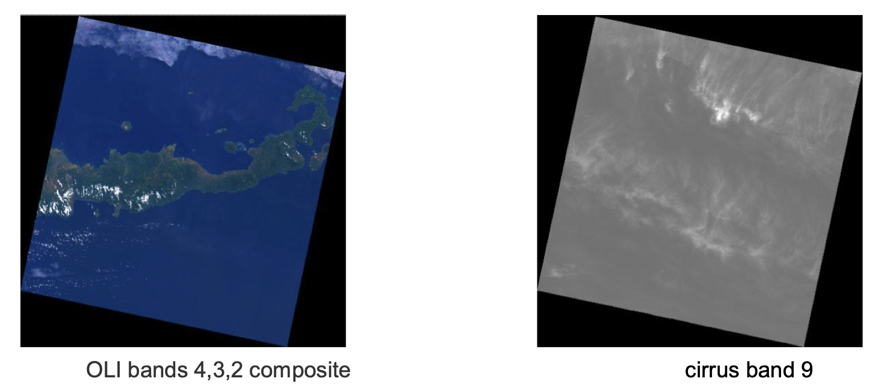
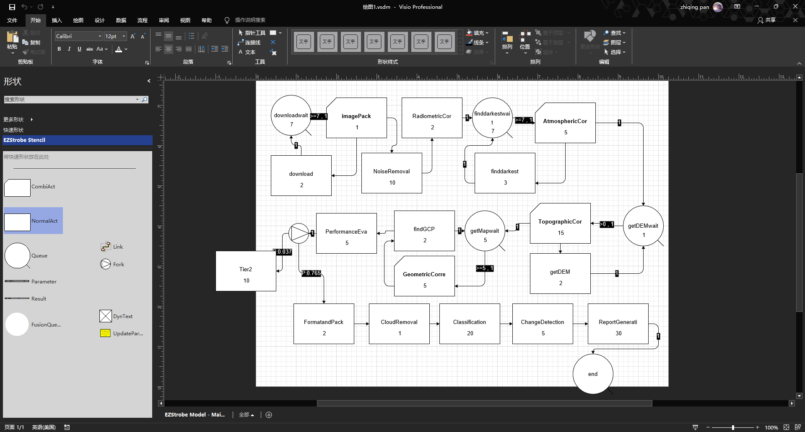

# Quiz 1
> - PanZhiQing 24037665g
<!-- table of content -->

## Table of contents
- [Problem Description](#problem-description)
- [EzStrobe model](#ezstrobe-model)
- [Analysis and Benefits](#analysis-and-benefits)
  - [Analysis of the EzStrobe Model Output](#analysis-of-the-ezstrobe-model-output)
  - [Practical Use in Reality](#practical-use-in-reality)
- [References](#references)


## Problem Description
In GIS(Geographic Information System), we have a full workflow for remote sensing data aquistion, processing, and analysis. In this quiz, we will focus on the LANDSAT 8 Satellite data processing workflow. Just as they discribed in the handbook$^1$, "Products available for download immediately; higher-level products available for download within 72 hours.", this workflow is a high-efficiency and typical remote sensing data processing workflow.

LANDSAT 8 Satellite can acquire about 700 scenes per day, and these data are all stored in the USGS archive. The satellite uses cloud cover predictions to avoid acquiring less useful data. It offers 16-day repetitive Earth coverage. A typical remote sensing data processing workflow can be described as follows:

### 1. Data Download

A standard size of LANDSAT 8 scene covers about 170 km x 183 km of the Earth's surface. The size of a single scene is about 700MB to 1GB. The Internet speed is about 1MB/s. We will download 7 bands of the remote sensing data, 2 minutes for each band. After downloading the remote sensing data, we will wait for the remote sensing data to be packed for about 1 minutes. The data download process takes about 15 minutes.

### 2. Signal Noise Removal
There are many kinds of noise in the remote sensing data, such as the line-drop noise, the random noise, and so on. For a single scene, the signal noise removal process takes about 10 minutes.



Figure 1. A Simple Random Noise Removal Process

### 3. Radiometric Correction
The satellite sensor can only capture the radiance of the Earth's surface(DN). The radiometric correction process is to convert the DN to the reflectance. This process is a simple linear transformation process. For a single scene, the radiometric correction process takes about 2 minutes.

### 4. Atmospheric Correction
The target of remote sensing is the Earth's surface, but the atmosphere will affect the remote sensing data. We can first measure the atmospheric influence and then correct the remote sensing data. A typical atmospheric correction process is the Dark Object Subtraction(DOS) method which needs to find the darkest object in the scene and then correct the whole scene. For a single scene, it will take about 3 minutes to find the darkest object in one band and then take about 5 minutes to correct the whole scene. So, the atmospheric correction process takes about 26 minutes in total.

### 5. Topographic Correction
The uneven terrain of the Earth surface is a key factor that leads to distortion in the remote sensing data. We tend to need the DEM(Digital Elevation Model) data to correct the remote sensing data. The DEM acquisition process is about 2 minutes, and the simple topographic correction process(Cosine Correction) is about 15 minutes.

<!--  -->
<!-- 设置大小 -->


Figure 2. Cosine Correction Process

### 6. Geometric Correction
In Geographic and Surveying, we need the control points to attach the remote sensing data to real-world coordinates. The geometric correction process is to find the control points and then resample the remote sensing data to the real-world coordinates. For a single scene, it will take about 10 minutes to find the control points (at least 4 points, about 2 mins a point and we find 5 points in total) and then take about 5 minutes to correct the whole scene. So, the geometric correction process takes about 15 minutes in total.

The control points are usually selected the easily recognizable points, such as the road intersection, the building corner, and so on. So we need a detailed map to find the control points and a experienced operator to select the control points. 


Figure 3. Control Points Attachment Process

### 7. Performance Evaluation
In this stage, we need to calculate the RMSE(Root Mean Square Error) to evaluate the performance of the remote sensing data processing workflow and then classify the remote sensing data in two classes: Tier 1 and Tier 2. The probability of the Tier 1 class varies with the cloud cover percentage of the scene. The probability of the Tier 1 and Tier 2 class for Landsat 8 OLI/TIRS is shown in Table 1. In next step, we only care about the Tier 1 class.

| Cloud Cover \ Products Values = % | 0-10 | 11-20 | 21-30 | 31-40 | 41-50 | 51-60 | 61-70 | 71-80 | 81-90 | 91-100 | Night | All |
|-----------------------------------|------|-------|-------|-------|-------|-------|-------|-------|-------|--------|-------|-----|
| L1TPT1                            | 76.5 | 76.5  | 77.3  | 77.0  | 76.0  | 74.2  | 72.2  | 69.3  | 61.7  | 22.7   | 1.1   | 63.3|
| L1TPT2                            | 3.7  | 3.9   | 3.7   | 3.7   | 3.8   | 3.8   | 3.7   | 3.4   | 3.3   | 2.8    | 0.5   | 3.5 |
| L1GTFB                            | 2.3  | 3.8   | 4.6   | 5.5   | 6.8   | 8.4   | 10.5  | 14.0  | 21.8  | 52.4   | 7.8   | 15.1|
| L1GTT2                            | 17.4 | 15.8  | 14.4  | 13.7  | 13.4  | 13.5  | 13.6  | 13.3  | 13.2  | 22.1   | 90.6  | 18.2|

Table 1. The Probability of the Tier 1 and Tier 2 Class for Landsat 8 OLI/TIRS$^2$

In this case, we think the cloud cover percentage is 10%, so the probability of the Tier 1 class is 76.5%. If the remote sensing data is classified as Tier 2, the system will suspend about 10 to simulate the reprocessing process. The performance evaluation process takes about 5 minutes.

### 8. Format and Package
Until this stage, the pre processing of the remote sensing data is finished. The format and package process takes about 2 minutes.

### 9. Cloud Removal
For Landsat 8 OLI/TIRS, the cloud removal process is a spectral dependence process. The cirrus band 9 (QA band) is used to detect the cloud. QA band based cloud removal process is very fast, it only takes about 1 minute for simple cloud removal.

Figure 4. Landsat 8 OLI/TIRS QA Band Band 9

### 10. Classification and Change Detection
We can detect the land cover of the remote sensing data by using the supervised classification method which needs the hand labeled training data. Labeling the training data is a time-consuming process, it takes about 20 minutes. The classification process is about 10 minutes. The change detection process is about 5 minutes.

### 11. Report Generation
We need write a report to summarize the remote sensing data processing workflow. The report may take about 30 minutes. Then, we attach a counter node to the end of the workflow to count the number of processed scenes.

## EzStrobe model
The EzStrobe model can be built like this:


Figure 5. EzStrobe Model

The output of the EzStrobe model is like this:
```
    Statistics Report at time of failure
    Statistics report at simulation time 302


    Queue          Res              Cur       Tot  AvWait    AvCont    SDCont MinCont   MaxCont
    ===========================================================================================
    downloadwait   ezs             6.00    107.00   16.93      6.00      0.00    6.00      7.00
    end            ezs         32917.00  32917.00   43.85   4779.97   7976.91    0.00  32917.00
    finddarkestwaitezs            18.00   1857.00    0.98      6.00      0.00    6.00     19.00
    getDEMwait     ezs           112.00  11226.00    0.00      0.00      0.00    0.00    112.00
    getMapwait     ezs          1424.00 103811.00    0.01      4.00      0.00    4.00   1424.00


    Activity        Cur     Tot     1stSt     LstSt   AvDur  SDDur   MinD    MaxD   AvInt  SDInt    MinI    MaxI
    ============================================================================================================
    AtmosphericCor   49    1839      0.00    301.00    5.00   0.00   5.00    5.00    0.16   0.43    0.00    8.00
    ChangeDetection4461   59202     35.00    302.00    5.00   0.00   5.00    5.00    0.00   0.08    0.00    7.00
    Classification 20853   80055     15.00    302.00   20.00   0.00  20.00   20.00    0.00   0.07    0.00    7.00
    CloudRemoval   1179   81234     14.00    302.00    1.00   0.00   1.00    1.00    0.00   0.07    0.00    7.00
    FormatandPack  2370   83604     12.00    302.00    2.00   0.00   2.00    2.00    0.00   0.07    0.00    7.00
    GeometricCorre 5535  102387      0.00    301.00    5.00   0.00   5.00    5.00    0.00   0.06    0.00    7.00
    NoiseRemoval      3     101      1.00    301.00   10.00   0.00  10.00   10.00    3.00   0.00    3.00    3.00
    PerformanceEva 6461   94172      7.00    302.00    5.00   0.00   5.00    5.00    0.00   0.07    0.00    7.00
    RadiometricCor    1      98     11.00    302.00    2.00   0.00   2.00    2.00    3.00   0.00    3.00    3.00
    ReportGenerati 21824   54741     40.00    302.00   30.00   0.00  30.00   30.00    0.00   0.08    0.00    7.00
    Tier2           531    4107     54.00    302.00   10.00   0.00  10.00   10.00    0.06   0.33    0.00   12.00
    TopographicCor 1480   11114      0.00    301.00   15.00   0.00  15.00   15.00    0.03   0.19    0.00    8.00
    download          1     101      1.00    301.00    2.00   0.00   2.00    2.00    3.00   0.00    3.00    3.00
    findGCP        2680   96852      5.00    302.00    2.00   0.00   2.00    2.00    0.00   0.07    0.00    7.00
    finddarkest      37    1790      5.00    302.00    3.00   0.00   3.00    3.00    0.17   0.44    0.00    8.00
    getDEM          199    9634     15.00    302.00    2.00   0.00   2.00    2.00    0.03   0.20    0.00    8.00
    imagePack         0     101      0.00    300.00    1.00   0.00   1.00    1.00    3.00   0.00    3.00    3.00


    Contents of the Future Events List at simulation time 302.00
```

## Analysis and Benefits 

### Analysis of the EzStrobe Model Output:
At simulation time 302, the system's behavior reveals task waiting times and processing efficiency across different queues.

Queue Analysis: 
In the downloadwait queue, there are 6 tasks waiting, with a total of 107 processed tasks and an average wait time of 16.93. Although the average wait time per task is 6.00, the maximum wait time of 7.00 indicates slow task processing, requiring optimization of the download process to reduce bottlenecks. The getMapwait queue has 1424 tasks with a total of 103,811 processed, showing a maximum wait time of 1424.00, despite an average wait time of only 0.01. This suggests a serious bottleneck that may require task parallelization or optimization of the map retrieval process. In the getDEMwait queue, 112 tasks are currently waiting, with a maximum wait time of 112.00. Addressing delays in this queue could involve task parallelization or improving DEM data processing speed.

Activity Analysis: 
The Classification step is one of the most time-consuming, with 20,853 tasks and an average duration of 20.00. Given its high frequency and long processing time, it is likely a major performance bottleneck. It could be accelerated using GPU or distributed computing frameworks such as Dask. The ChangeDetection step, with 59,202 tasks, has an average duration of 5.00 and shorter task intervals (maximum of 7). Although the duration is shorter, its high frequency makes it impactful on system performance. ReportGeneration is another high-demand activity, with 21,824 tasks and an average duration of 30.00. Given the large volume of tasks, it may benefit from optimization through batch processing or automation to reduce total processing time. AtmosphericCorrection, with 1,839 tasks, has a shorter average duration of 5.00, and is unlikely to be a bottleneck.

Suggestions for Improvement: 
The long wait time in the downloadwait queue could be reduced by increasing bandwidth or improving preprocessing. For getMapwait, where the maximum wait time reaches 1424.00, task parallelization could enhance throughput, while caching or optimizing map requests could address time intensity. The Classification step, being highly time-consuming, may benefit from GPU acceleration or distributed computing frameworks like Dask. For ReportGeneration, efficiency could be improved by automating and partitioning tasks to handle large volumes. By identifying key bottlenecks, such as in Classification and getMapwait, the overall system efficiency can be significantly enhanced. The detailed simulation report offers a clear basis for implementing targeted optimizations to reduce wait times, increase throughput, and optimize high-frequency, high-demand tasks.

### Practical Use in Reality:
The EzStrobe model is a powerful tool for evaluating and optimizing remote sensing workflows in practice. By simulating real-world conditions, it allows for **data-driven decisions** on how to allocate resources, improve processing times, and ensure scalability.

1. **Performance Optimization**: The model is useful for real-world applications where resource-intensive remote sensing data must be processed efficiently. By identifying key bottlenecks, such as in the **classification** and **map retrieval** steps, the model allows organizations to implement targeted optimizations like **parallel processing**, **task batching**, or **GPU acceleration**, significantly improving throughput and reducing delays.

2. **Scalability Testing**: This model can be employed to simulate how the system will behave under increasing data loads. For example, if handling high-resolution satellite images or large geographical areas, the simulation helps assess how well current infrastructure and algorithms scale, allowing for better **resource allocation** and **system design** before deployment.

3. **Predictive Planning**: In operational settings, the model allows teams to simulate different workflows, anticipate delays, and adjust resources in advance. For instance, it can simulate the impact of adding more computational nodes or bandwidth and predict how these changes affect overall processing times.

4. **Cost-Benefit Analysis**: By adjusting variables such as processing power, task parallelization, or network bandwidth, the model can be used to perform **cost-benefit analyses**. This helps decision-makers justify investments in more powerful hardware, parallel computing setups, or data optimization techniques to improve overall system performance.

5. **Benchmarking and Reporting**: The model provides a way to generate **performance benchmarks** for different parts of the remote sensing workflow. These benchmarks can be used for performance comparison over time, ensuring that new techniques or hardware upgrades are achieving the desired efficiency gains.

6. **Training and Simulation**: The model can be employed as an educational tool for training remote sensing engineers or researchers. It allows them to explore how different processing stages work and how changes in resource allocation or algorithm performance affect the overall system.


## References
1. [Landsat 8 (L8) Data Users Handbook](https://d9-wret.s3.us-west-2.amazonaws.com/assets/palladium/production/s3fs-public/atoms/files/LSDS-1574_L8_Data_Users_Handbook-v5.0.pdf)
2. [Landsat Levels of Processing](https://www.usgs.gov/landsat-missions/landsat-levels-processing)