# 真实数据获取及分析
- https://www.hko.gov.hk/en/abouthko/opendata_intro.htm
  
我们从香港天文台的数据开放平台中下载了最近二十多年的风向、风速及湿度数据。通过分析这些累计数据，我们可以获得研究区域一些关键气象特征的统计分布，以便后续基于此进行蒙特卡洛模拟。

We downloaded the wind direction, wind speed and humidity data from the Hong Kong Observatory's data open platform for the past twenty years. By analyzing these accumulated data, we can obtain the statistical distribution of some key meteorological characteristics of the study area, so as to carry out Monte Carlo simulation based on this in the future.

## 风向数据
风向数据是以度数表示的，0度代表正北方向，90度代表正东方向，以此类推。气象站在搜集数据时，存在一些数据不完整的情况，数据集中将这些数据标记为“#”，我们可以过滤掉这些数据，只保留完整的数据进行分析。

Wind direction data is expressed in degrees, with 0 degrees representing due north and 90 degrees representing due east, and so on. When the meteorological station collects data, there are some incomplete data, and these data are marked as "#" in the data set. We can filter out these data and keep only complete data for analysis.

| Notation | Description |
| --- | --- |
| *** | unavailable |
| # | data incomplete |
| C | data Complete |

Table 1. Notation of wind direction data integrity

在统计过程中，为了方便分析，我们将风向数据分为八个方向，分别是N、NE、E、SE、S、SW、W、NW。我们统计了风向数据的分布情况。研究区域的的盛行风向有北风、东风及东北风。其中，北风的盛行风向占比最高，其次是东风，东北风的盛行风向占比最低。这与研究区域的地理位置有关，研究区域位于香港的西北部，北风、东风及东北风是主要的风向。

In the statistical process, for the convenience of analysis, we divide the wind direction data into eight directions, namely N, NE, E, SE, S, SW, W, NW. We have counted the distribution of wind direction data. The prevailing wind directions in the study area are north, east and northeast. Among them, the prevailing wind direction of north wind is the highest, followed by east wind, and the prevailing wind direction of northeast wind is the lowest. This is related to the geographical location of the study area. The study area is located in the northwest of Hong Kong, and the prevailing wind directions are north, east and northeast.

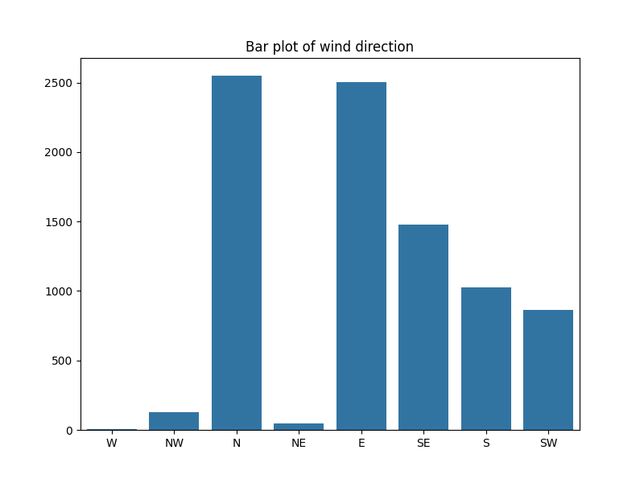
Figure 1. Bar chart of wind direction distribution

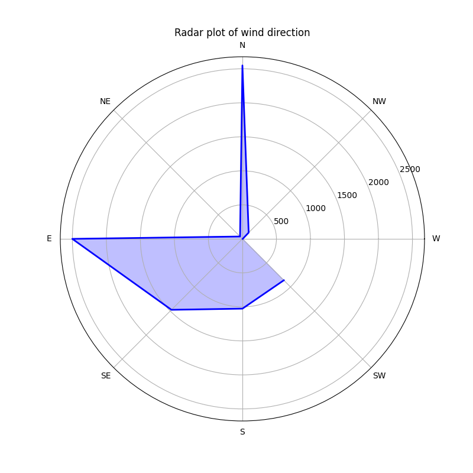
Figure 2. Radar chart of wind direction distribution

累积所有数据，我们得到了风向数据的统计分布如下：

After accumulating all the data, we obtained the statistical distribution of wind direction data as follows:

| Wind Direction | Proportion |
| --- | --- |
| N | 0.296650 |
| E | 0.290949 |
| SE | 0.171591 |
| S | 0.119358 |
| SW | 0.100163 |
| NW | 0.015123 |
| NE | 0.005700 |
| W | 0.000465 |

Table 2. Wind direction distribution statistics

## 风速数据
风速数据是以米每秒（m/s）表示的。我们统计了风速数据的分布情况。研究区域的风速主要集中在10m/s到20m/s之间，其中17m/s的风速占比最高。风速的分布情况如下图所示。

Wind speed data is expressed in meters per second (m/s). We have counted the distribution of wind speed data. The wind speed in the study area is mainly concentrated between 10m/s and 20m/s, with 17m/s wind speed accounting for the highest proportion. The distribution of wind speed is shown in the following figure.

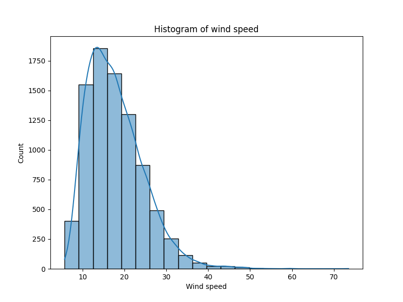
Figure 3. Bar chart of wind speed distribution

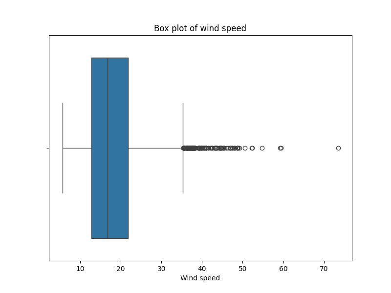
Figure 4. Box plot of wind speed distribution

逐年对风速数据经行可视化，并叠加显示在一张图中有：

The wind speed data is visualized year by year, and overlaid on one chart:

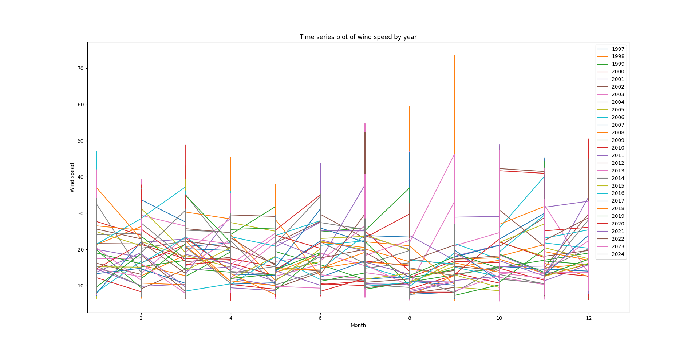
Figure 5. Wind speed distribution by year

累积所有数据，我们得到了风速数据的统计分布如下：

After accumulating all the data, we obtained the statistical distribution of wind speed data as follows:

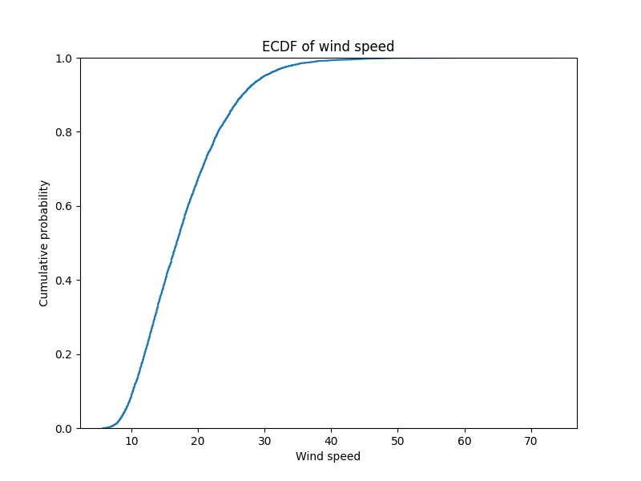
Figure 6. Wind speed accumulation distribution

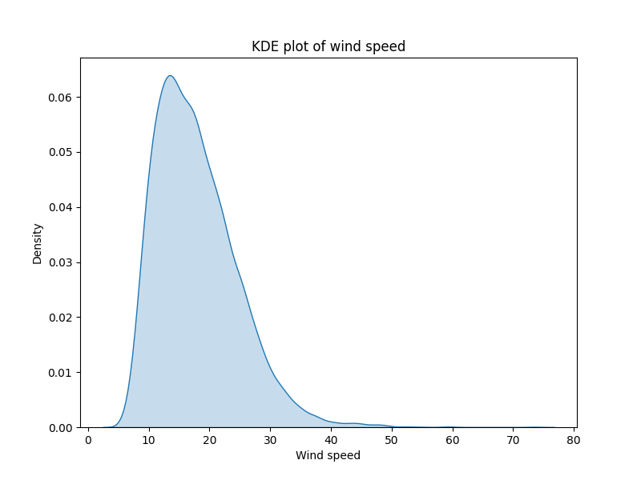
Figure 7. Wind speed probability distribution

| Mean Wind Speed | Standard Deviation of Wind Speed |
| --- | --- |
| 17.842082606166375 | 6.709404241331985 |

Table 3. Wind speed distribution statistics

## 湿度数据 HUMIDITY DATA
湿度数据是以百分比表示的。我们统计了湿度数据的分布情况。研究区域的湿度主要集中在70%到90%之间，其中80%的湿度占比最高。湿度的分布情况如下图所示。

Humidity data is expressed as a percentage. We have counted the distribution of humidity data. The humidity in the study area is mainly concentrated between 70% and 90%, with 80% humidity accounting for the highest proportion. The distribution of humidity is shown in the following figure.

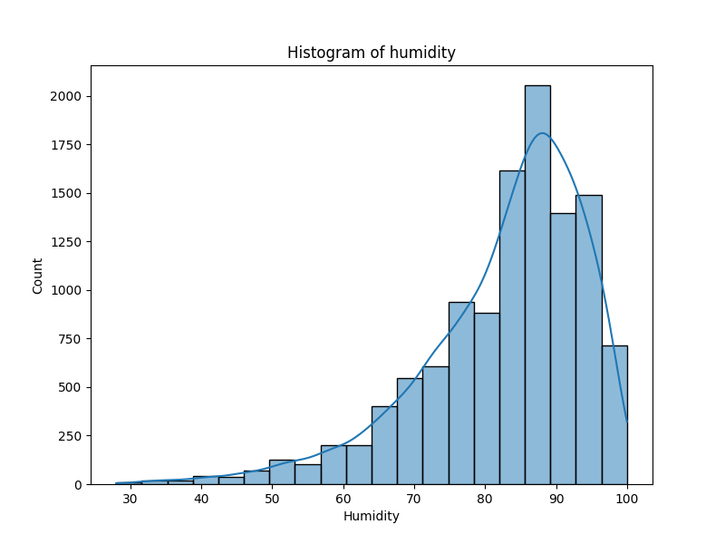
Figure 8. Bar chart of humidity distribution

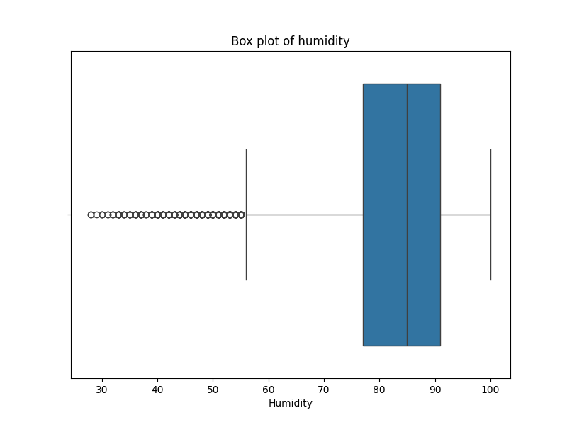
Figure 9. Box plot of humidity distribution

将数据集中所有年份的湿度数据进行可视化，得到如下图：

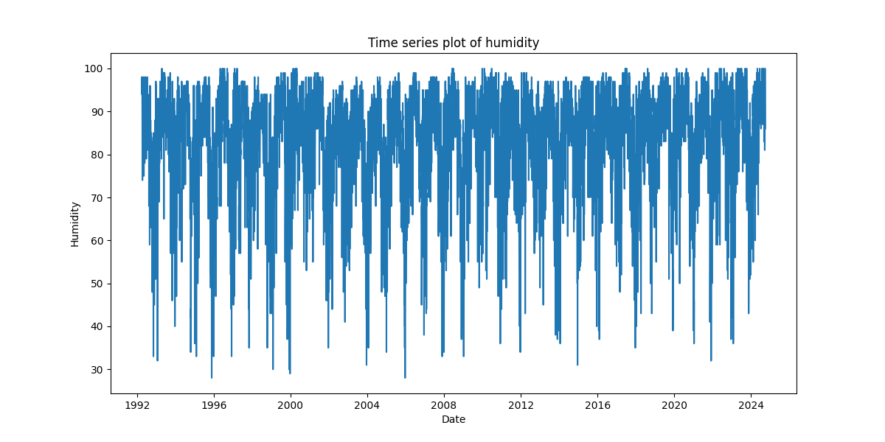
Figure 10. Humidity distribution by year

若将其叠加到一张图中，得到如下图：

If we overlay them on one chart, we get the following chart:

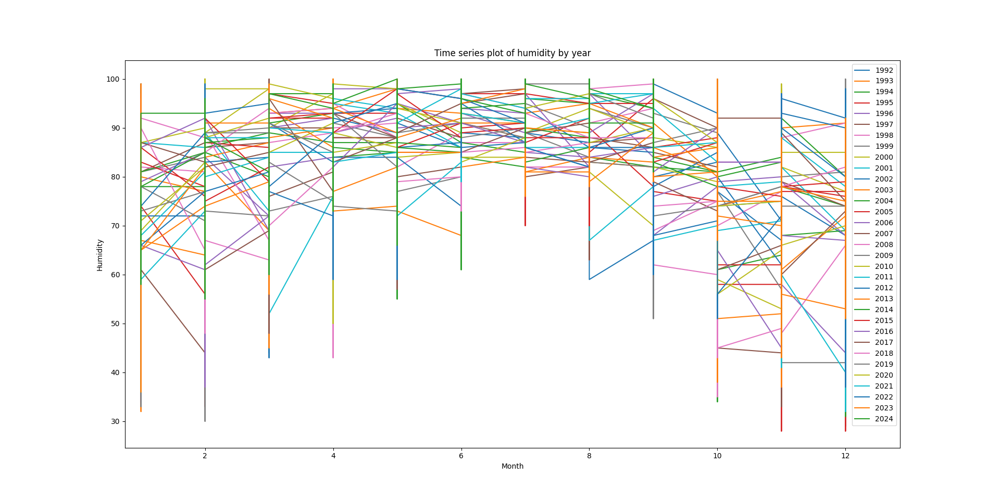
Figure 11. Humidity distribution by year

累积所有数据，我们得到了湿度数据的统计分布如下：

After accumulating all the data, we obtained the statistical distribution of humidity data as follows:

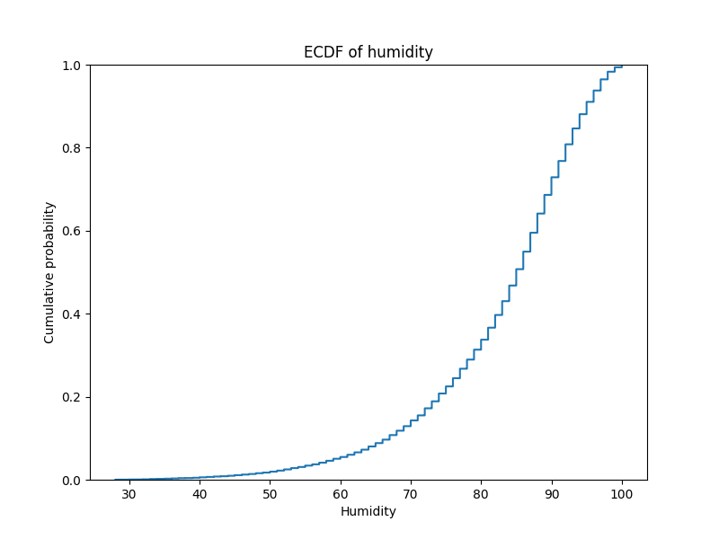
Figure 12. Humidity accumulation distribution

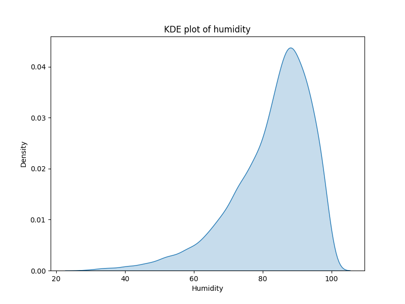
Figure 13. Humidity probability distribution

| Mean Humidity | Standard Deviation of Humidity |
| --- | --- |
| 82.65597489758564 | 11.679318452222946 |

Table 4. Humidity distribution statistics

## 消防人员数据

森林消防员平均灭火时间会因多种因素而异，包括火灾规模、火灾类型（地表火、树冠火或地下火）、气象条件、地形复杂性、可用资源，以及消防队的经验水平。根据美国国家跨部门消防中心（NIFC）的统计，火灾可以大致分为小规模、中等规模和大规模三类，其灭火时间也有所不同。对于小规模火灾，覆盖范围大约在几公顷内，消防员通常能在数小时到1天内控制火势。中等规模火灾覆盖范围在几十到几百公顷，需要更多资源如直升机、灭火飞机等及经验丰富的消防员，通常需要1到7天时间才能完全控制。生在干旱、风大的地区，大规模火灾覆盖范围超过几千公顷，可能需要数周甚至数月才能完全控制，这种火灾一般只能通过被动的方法扑灭，如等待天气转凉、燃烧区域自然消失等。

Firefighter average extinguishing time will vary due to a variety of factors, including fire size, fire type (surface fire, crown fire or underground fire), meteorological conditions, terrain complexity, available resources, and the experience level of the fire brigade. According to the National Interagency Fire Center (NIFC) statistics, fires can be roughly divided into small, medium and large fires, and their extinguishing times are also different. For small fires, covering an area of about a few hectares, firefighters can usually control the fire within a few hours to a day. Medium-sized fires cover an area of tens to hundreds of hectares, requiring more resources such as helicopters, fire-fighting aircraft, and experienced firefighters, and usually take 1 to 7 days to fully control. In areas with drought and strong winds, large fires covering an area of more than a few thousand hectares may take several weeks or even months to fully control, and such fires can generally only be extinguished passively, such as waiting for the weather to cool down, and the burning area to naturally disappear.

不同的消防员团队、不同的国家和地区，其灭火效率也有所不同。中国森林消防的效率较高，在较小的森林火灾中通常可以在1到2天内基本控制火情。不过，对大规模山火（如云南、四川等地）则需要数周。美国的消防员团队在灭火效率上也有很高的水平，但由于美国地域广阔，山火频发，因此在大规模山火的灭火上也需要较长时间。澳大利亚由于地广人稀，山火频发，在大规模山火的灭火上需要较长时间。在加拿大，火灾持续时间受到气候和燃料干燥程度的显著影响，过去几十年中，由于气候变化，大型火灾的频率和持续时间显著增加。

Different firefighter teams, different countries and regions have different fire extinguishing efficiency. China's forest firefighting efficiency is relatively high, and small forest fires can usually be basically controlled within 1 to 2 days. However, large-scale mountain fires (such as Yunnan, Sichuan, etc.) require several weeks. The U.S. firefighter team also has a high level of efficiency in fire extinguishing, but due to the vast territory of the United States and frequent mountain fires, it also takes a long time to extinguish large-scale mountain fires. Australia, due to its vast land and sparse population, requires a long time to extinguish large-scale mountain fires. In Canada, the duration of fires is significantly affected by climate and fuel dryness. In the past few decades, due to climate change, the frequency and duration of large fires have increased significantly.

森林火灾的初期扑救是最关键的，如果能在火灾初期控制住火势，那么火灾的扩散就会受到很大的限制。因此，消防员的快速反应和高效扑救是非常重要的。在火灾初期，消防员通常会使用直升机、灭火飞机等空中资源，以及地面消防队员，通过围堵火线、灭火等方式控制火势。在火灾扩大后，消防员通常会使用更多的资源，如更多的直升机、灭火飞机、消防车辆等，以及更多的消防员，通过更多的围堵火线、灭火等方式控制火势。

The initial suppression of forest fires is the most critical. If the fire can be controlled at the beginning of the fire, the spread of the fire will be greatly restricted. Therefore, the rapid response and efficient suppression of firefighters are very important. In the early stages of a fire, firefighters usually use aerial resources such as helicopters, fire-fighting aircraft, and ground firefighters to control the fire by blocking the fire line and extinguishing the fire. After the fire expands, firefighters usually use more resources, such as more helicopters, fire-fighting aircraft, fire trucks, and more firefighters, to control the fire by more blocking the fire line and extinguishing the fire.

## 数据来源
- 香港天文台数据开放平台
- 风向数据 - https://data.gov.hk/en-data/dataset/hk-hko-rss-daily-prevailing-wind-direction
- https://www.nifc.gov/resources/firefighters