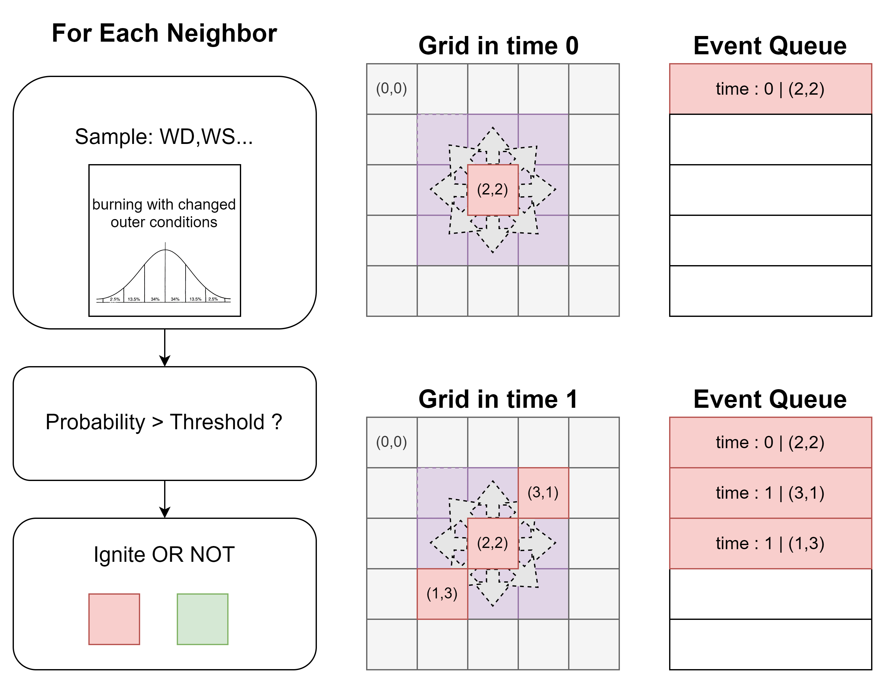
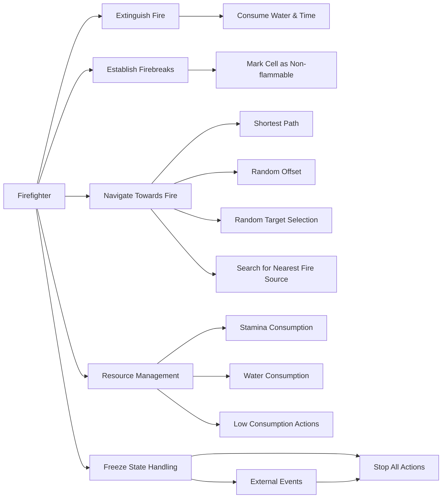
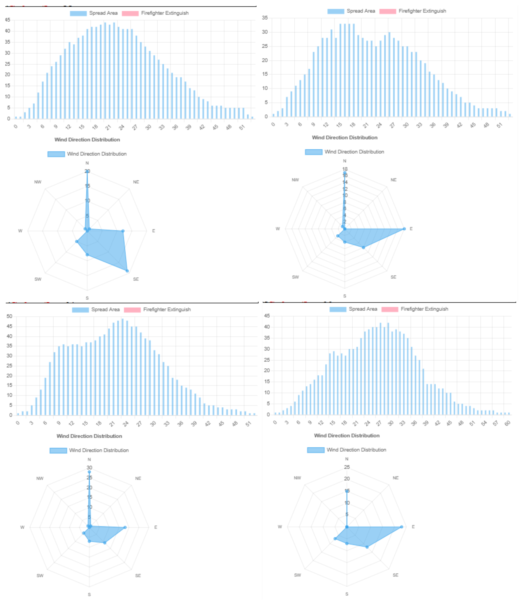
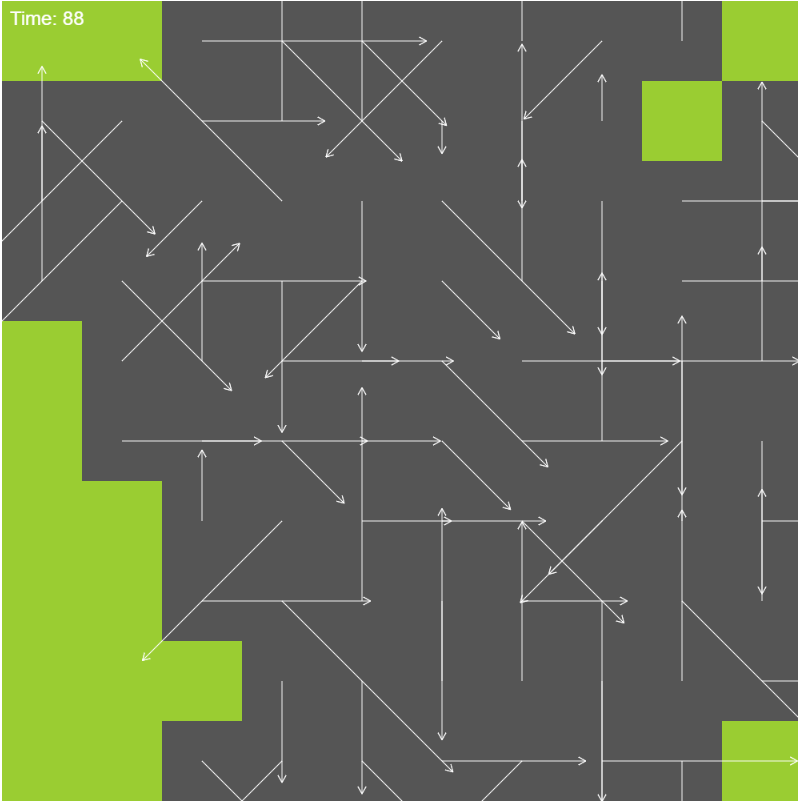
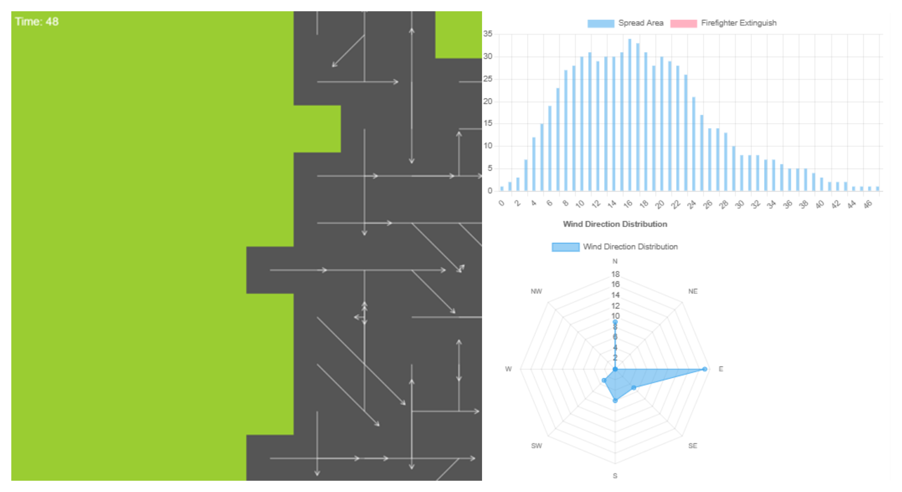
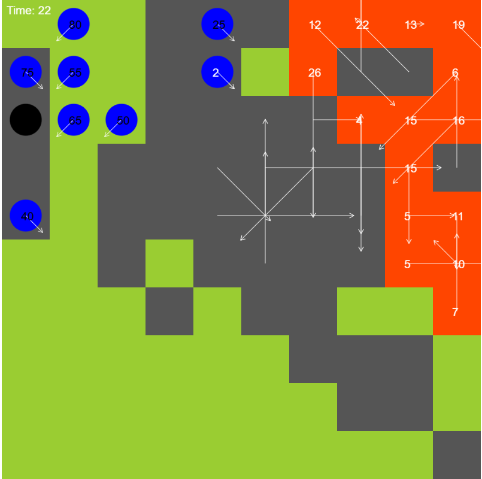
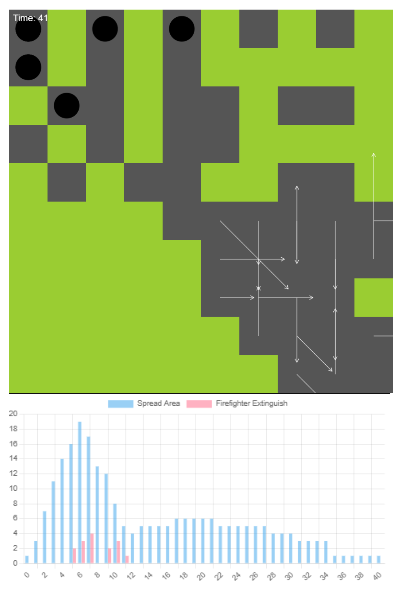

# Simulation procedures

## 1. Discrete Event Simulation From Scratch

我们使用 JavaScript 语言，在现代浏览器中实现了一个简单的离散事件模拟系统。离散事件模拟需要维护一个由事件组成的有序（按时间排序）队列。每次处理队列中的一个事件，然后根据事件的类型和内容，更新系统的状态，并将新的事件加入队列。我们使用了一个简单的 `EventQueue` 类来实现这个功能。

We implemented a simple discrete event simulation system in JavaScript. Discrete event simulation requires maintaining an ordered queue of events (sorted by time). Each time an event is processed from the queue, the system state is updated based on the type and content of the event, and new events are added to the queue. We used a simple `EventQueue` class to implement this functionality.

本文使用二维格网模型来模拟一片可以燃烧的区域，每一个cell包含三种燃烧状态：未燃烧、燃烧中、燃烧完毕。每个cell的燃烧状态会随着时间的推移而改变，cell处于燃烧状态时会向周围的cell传播火焰，传播火焰的行为是否成狗受到蒙特卡洛模拟（风速、风向等）影响。我们实现了[Cell](../project/cell.js)类和[Grid](../project/grid.js)类来管理格网行为并存储格网数据。

We used a two-dimensional grid model to simulate a burnable area, where each cell has three burning states: unburned, burning, and burned out. The burning state of each cell changes over time, and when a cell is burning, it spreads flames to neighboring cells. The behavior of flame propagation is influenced by Monte Carlo simulations (wind speed, wind direction, etc.). We implemented the "Cell" and "Grid" classes to manage grid behavior and store grid data.

Figure 14: Discrete Event Simulation Structure

接下来具体介绍火焰传播模型。火焰传播模型[FireSpreadEvent](../project/models/fire.js)继承自Event类，是具体描述火焰传播行为的类。该类依赖环境类传入的，真实世界统计得到的概率分布参数，通过蒙特卡洛模拟的方式，模拟环境参量。

Next, we will introduce the fire spread model in detail. The fire spread model "FireSpreadEvent" inherits from the "Event" class and is a specific class that describes the behavior of fire spread. This class depends on the probability distribution parameters obtained from real-world statistics passed in by the environment class and simulates environmental parameters through Monte Carlo simulations.

### 2.1 Environment & Distribution
[Distribution](../project/distributions.js)文件主要用来实现一些概率分布的类及蒙特卡洛模拟方法。

- `MonteCarloDistribution` 提供了统一的分布抽象接口，使得不同分布类具有一致的采样和描述方法。
  - 该类是一个抽象基类，定义了 Monte Carlo 模拟中分布类的基本接口。它不能直接实例化，提供了通用的方法结构，要求继承的子类实现以下两个核心方法：
    - **sample()**：抽象方法，生成符合特定分布的随机样本。子类必须实现该方法，以便生成符合其特定分布的随机数。
    - **describe()**：可选的描述方法，用于输出分布的描述信息。子类可选择实现此方法以返回分布的特征信息。
- `GaussianDistribution` 使用 Box-Muller 变换实现正态分布采样，适用于模拟连续的对称分布场景。
  - 该类继承自 `MonteCarloDistribution`，表示高斯（正态）分布。它采用 Box-Muller 变换生成正态分布随机数。此分布的特点是对称于均值，且样本点主要集中在均值附近。
    - **mean**：均值，控制分布的中心位置。
    - **standardDeviation**：标准差，决定分布的宽度（数据的离散程度）。标准差越大，分布越分散；标准差越小，分布越集中。
- `DiscreteDistribution` 使用累积分布实现离散事件的采样，通过定义不同事件的概率来模拟离散分布场景。
  - 该类同样继承自 `MonteCarloDistribution`，用于表示离散分布。它接收一个概率映射，将一组离散事件与其发生概率关联起来。
    - **_buildCumulative()**：内部方法，用于计算累积分布（cumulative distribution function, CDF）。通过累加每个事件的概率，生成一个累积概率数组，供 `sample()` 方法使用。
    - **sample()**：生成符合离散分布的随机样本。通过生成一个随机数，并与累积分布数组进行比较，返回对应的事件。该方法确保采样过程符合设定的概率分布。
    - **describe()**：返回一个包含事件及其概率的字符串描述，用于快速了解分布特征。

结合上述具体的分布类，我们就可以将其统一在一个环境类下，提供给火焰传播模型使用。[Environment](../project/models/environment.js)类主要用来管理火焰传播模型的环境参数，包括风速、风向等。

"MonteCarloDistribution" provides a unified distribution abstraction interface, allowing different distribution classes to have consistent sampling and description methods. This class is an abstract base class that defines the basic interface of distribution classes in Monte Carlo simulations. It cannot be instantiated directly and provides a common method structure, requiring inheriting subclasses to implement the following two core methods:
    1. "sample()": an abstract method that generates random samples that conform to a specific distribution. Subclasses must implement this method to generate random numbers that conform to their specific distribution.
    2. "describe()": an optional description method used to output distribution information. Subclasses can choose to implement this method to return the characteristics of the distribution.

"GaussianDistribution" uses the Box-Muller transform to sample from a normal distribution, suitable for simulating continuous symmetric distribution scenarios. This class inherits from "MonteCarloDistribution" and represents a Gaussian (normal) distribution. It uses the Box-Muller transform to generate random numbers from a normal distribution. The distribution is symmetric around the mean, and sample points are mainly concentrated near the mean. The "mean" parameter controls the center position of the distribution, while the "standardDeviation" parameter determines the width of the distribution (the degree of data dispersion). The larger the standard deviation, the more dispersed the distribution; the smaller the standard deviation, the more concentrated the distribution.

"DiscreteDistribution" uses a cumulative distribution to sample from discrete events by defining the probabilities of different events to simulate discrete distribution scenarios. This class also inherits from "MonteCarloDistribution" and is used to represent discrete distributions. It accepts a probability mapping that associates a set of discrete events with their occurrence probabilities. The "_buildCumulative()" method is an internal method used to calculate the cumulative distribution function (CDF). By summing the probabilities of each event, it generates a cumulative probability array for the "sample()" method to use. The "sample()" method generates random samples that conform to the discrete distribution. By generating a random number and comparing it with the cumulative distribution array, it returns the corresponding event. This method ensures that the sampling process conforms to the specified probability distribution. The "describe()" method returns a string description containing events and their probabilities for a quick understanding of the distribution characteristics.

### 2.2 FireSpreadEvent
#### `FireSpreadEvent` 类
用于模拟火灾蔓延的事件。核心逻辑包括火势扩散、剩余燃烧时间更新、风力对火势影响的计算。
  
- **execute() 方法**：核心方法，执行火灾扩散逻辑。
  - 获取当前单元格状态，若单元格为“未燃烧”状态，则将其标记为“燃烧中”，并基于风速设定燃烧时间。
  - 遍历相邻单元格，并根据风向和火势扩散概率，判断是否触发火势蔓延。
  - 若当前单元格燃烧时间耗尽，生成 `BurnOutEvent` 事件；否则，继续生成下一时刻的 `FireSpreadEvent` 事件。
- **calculateSpreadProbability() 方法**：计算火势蔓延到邻居单元格的概率，考虑风向和阻燃性。结果缓存以提升效率。
- **forEachNeighbor() 方法**：遍历并处理相邻单元格，用于扩散逻辑。
- **getDirectionFactor() 方法**：计算风向与邻居方向的夹角，以此调整扩散概率。

在 `FireSpreadEvent` 类的火灾扩散模型中，涉及到多个数学公式，主要用于火势蔓延概率的计算以及风向的影响。

"FirespreadEvent" is an event used to simulate the spread of a fire. The core logic includes fire spread, updating the remaining burning time, and calculating the impact of wind on the fire. When the "execute()" method is called, the following steps are performed:1) The current cell state is obtained. If the cell is in an "unburned" state, it is marked as "burning," and the burning time is set based on the wind speed. 2) The neighboring cells are traversed, and based on the wind direction and the probability of fire spread, it is determined whether the fire will spread. 3) If the burning time of the current cell is exhausted, a "BurnOutEvent" is generated; otherwise, the next "FireSpreadEvent" event is generated.

The "calculateSpreadProbability()" method calculates the probability of fire spreading to neighboring cells, considering the wind direction and fire resistance. The results are cached to improve efficiency. The "forEachNeighbor()" method is used to traverse and process neighboring cells for the spread logic. The "getDirectionFactor()" method calculates the angle between the wind direction and the neighboring direction to adjust the spread probability.

#### `BurnOutEvent` 类
`BurnOutEvent`类：这是一个继承自`Event`类的事件，用于表示网格中某个单元格在指定时间点完成燃烧过程并变为“烧毁”状态。它在初始化时接收时间、网格对象，以及目标单元格的坐标（`x`和`y`）。当事件被执行（调用`execute`方法）时，它会将目标单元格的状态更新为`"burned"`，并从网格中移除其“正在燃烧”的状态（通过调用`grid.removeBurningCell`方法），从而完成该单元格的燃烧生命周期管理。

"BurnOutEvent" is an event that inherits from the "Event" class and is used to represent a cell in the grid that has completed the burning process at a specified time and is in the "burned" state. It receives the time, grid object, and the coordinates (x and y) of the target cell as parameters during initialization. When the event is executed (the "execute()" method is called), it updates the state of the target cell to "burned" and removes the "burning" state from the grid (by calling the "grid.removeBurningCell()" method), thereby completing the management of the cell's burning lifecycle.

在火灾模拟系统中，`Firefighter`类承担了模拟消防员行为的核心角色，其职责包括扑灭火灾、铺设隔离带以及根据资源限制制定行动策略。类的设计涵盖属性定义、行为逻辑和网格交互，使其能够动态应对模拟环境中的复杂情况。消防员具备诸如体力、水量、位置、移动方向及目标单元格等属性，结合冻结状态与灭火时间等机制，确保模拟能够以较高的现实性展现消防员的行为。

In the fire simulation system, the "Firefighter" class plays a central role in simulating firefighter behavior. Its responsibilities include extinguishing fires, setting isolation zones, and formulating action strategies based on resource constraints. The class's design covers property definitions, behavioral logic, and grid interactions, allowing it to dynamically respond to complex situations in the simulation environment. Firefighters have attributes such as stamina, water level, position, movement direction, and target cells. Combined with mechanisms such as freezing status and extinguishing time, the class ensures that the simulation can realistically represent firefighter behavior.

在行为设计上，`Firefighter`类通过方法的模块化实现了关键功能。例如，`move`方法允许消防员在网格中移动，并通过目标有效性检查避免无效操作。核心方法`act`则根据消防员当前位置的状态选择相应行为：在燃烧单元格上触发灭火事件；在未燃烧单元格处有概率铺设隔离带；在其他情况下搜索火源并向其移动。这一过程充分考虑了资源消耗与冻结状态的约束，使消防员的行为既智能又受环境影响。为了实现动态互动，类还提供了设置隔离带与向火源移动的功能，模拟消防员在实际任务中的操作方式，例如随机调整路径以避免单一模式的移动。

In terms of behavior design, the "Firefighter" class implements key functions through method modularization. For example, the "move()" method allows firefighters to move in the grid and avoids invalid operations through target validity checks. The core method "act()" selects the corresponding behavior based on the current position of the firefighter: triggering extinguishing events on burning cells; probabilistically setting isolation zones on unburned cells; and searching for the fire source and moving towards it in other cases. This process fully considers resource consumption and freezing status constraints, making firefighter behavior both intelligent and environmentally influenced. To achieve dynamic interaction, the class also provides functions to set isolation zones and move towards the fire source, simulating the operational methods of firefighters in actual tasks, such as randomly adjusting paths to avoid single-mode movement.

`Firefighter`类的功能设计注重细节与现实感。铺设隔离带的操作通过触发事件实现，并消耗一定的体力，强化了资源管理的模拟深度；而移动过程中通过矢量计算并结合随机偏移优化了路径选择。此外，搜索最近燃烧单元格的方法支持筛选特定数量的目标，为消防员的行动策略提供了灵活性。总的来说，消防员的行为可以概括为以下几类：扑灭火灾、设置防火隔离、智能化路径移动，以及水量与体力管理。这些行为使消防员能够在动态环境中完成复杂任务，并通过网格系统的交互增强了模拟的整体表现力。

The "Firefighter" class's functional design focuses on detail and realism. The operation of setting isolation zones is implemented by triggering events and consumes a certain amount of stamina, enhancing the simulation depth of resource management. The path selection is optimized by vector calculation and random offset during movement. In addition, the method of searching for the nearest burning cell supports filtering a specific number of targets, providing flexibility for the firefighter's action strategy. In general, firefighter behavior can be summarized into several categories: extinguishing fires, setting fire isolation zones, intelligent path movement, and water and stamina management. These behaviors enable firefighters to complete complex tasks in a dynamic environment and enhance the overall expressiveness of the simulation through grid system interaction.

设计亮点在于模块化与事件驱动的结合。灭火和隔离带设置事件实现了行为逻辑与环境变化的解耦，提高了代码的扩展性。随机性与策略性行为设计相辅相成，为模拟增添了不确定性与决策挑战。体力和水量的资源消耗模型则提供了更具现实感的约束条件，为模拟决策设计提供依据。此外，灵活的目标选择逻辑为消防员行为的扩展奠定了基础，例如未来可以引入合作灭火或动态优先级调整策略。

The design highlights the combination of modularization and event-driven. The implementation of extinguishing and isolation zone setting events decouples behavior logic from environmental changes, improving code scalability. The complementary design of randomness and strategic behavior adds uncertainty and decision challenges to the simulation. The resource consumption model of stamina and water level provides more realistic constraints and a basis for simulation decision design. In addition, flexible target selection logic lays the foundation for extending firefighter behavior, such as introducing cooperative firefighting or dynamic priority adjustment strategies in the future.

消防员在模拟中遵循多种策略来完成扑灭火灾、阻止火势蔓延和优化自身资源管理的任务。这些策略以消防员的环境感知为基础，通过逻辑判断和目标优化实现。

Firefighters follow multiple strategies in the simulation to extinguish fires, prevent fire spread, and optimize their resource management. These strategies are based on the firefighters' environmental awareness and are implemented through logical reasoning and target optimization.

#### **1. 优先灭火策略 (Prioritize Firefighting)**  
消防员的首要任务是扑灭火灾。当站在燃烧的单元格上时，消防员会触发一系列事件以开始灭火。此过程中，消防员会消耗水量和时间来完成灭火，确保火源被快速控制。如果当前单元格已被其他消防员占据，则消防员会优先移动到其他火源位置。此策略体现了火灾应对的紧迫性。

Firefighters' primary task is to extinguish fires. When standing on a burning cell, firefighters trigger a series of events to start extinguishing the fire. During this process, firefighters consume water and time to complete the extinguishing, ensuring that the fire source is quickly controlled. If the current cell is already occupied by another firefighter, the firefighter will move to another fire source location first. This strategy reflects the urgency of firefighting.

#### **2. 隔离带设置策略 (Establish Firebreaks)**  
如果消防员站在未燃烧的单元格上，并且该位置靠近燃烧区域，有一定概率会铺设隔离带。这一策略通过将单元格标记为不可燃状态来限制火势蔓延，特别适用于火势较大的场景。隔离带的设置依赖于消防员的体力资源，确保在资源允许的情况下最大化防御效果。

If a firefighter is standing on an unburned cell near the burning area, there is a certain probability that they will set up a firebreak. This strategy limits the spread of the fire by marking the cell as non-flammable, especially in large fire scenarios. The establishment of firebreaks depends on the firefighter's stamina resources, ensuring that the defensive effect is maximized within the available resources.

#### **3. 火源导航策略 (Navigate Towards Fire)**  
当消防员不在燃烧单元格上时，他们会搜索最近的火源并向其移动一步。这一策略基于最短路径原则，结合随机偏移以避免路径规划的单调性。消防员还可以在多个目标之间随机选择，确保对火势的全面覆盖。这一策略优化了消防员的行动效率，同时避免了重复移动。

When firefighters are not on a burning cell, they search for the nearest fire source and move towards it. This strategy is based on the shortest path principle, combined with random offsets to avoid the monotony of path planning. Firefighters can also randomly select from multiple targets to ensure comprehensive coverage of the fire. This strategy optimizes the efficiency of firefighter actions while avoiding repeated movements.

#### **4. 资源管理策略 (Resource Management)**  
消防员的行动受到体力和水量的限制。每次移动消耗体力，灭火则同时消耗水量和体力。当资源不足时，消防员会优先选择低消耗行为（如移动），避免浪费有限资源。这一策略确保消防员在行动中的持续性，同时为复杂场景下的补给逻辑提供了接口。

Firefighter actions are limited by stamina and water level. Each movement consumes stamina, while extinguishing fires consumes both water and stamina. When resources are insufficient, firefighters will prioritize low-consumption actions (such as movement) to avoid wasting limited resources. This strategy ensures the continuity of firefighters' actions and provides an interface for supply logic in complex scenarios.

#### **5. 冻结状态策略 (Freeze State Handling)**  
当消防员处于冻结状态（如受外部事件影响）时，他们会停止所有行动。这一策略在逻辑上确保消防员的状态与环境事件联动，同时为模拟中引入更多复杂情境（如中毒、障碍物等）提供了扩展空间。

When firefighters are in a frozen state (e.g., due to external events), they stop all actions. This strategy logically ensures that the firefighters' state is linked to environmental events and provides room for introducing more complex scenarios (such as poisoning, obstacles, etc.) in the simulation.

Strategy Diagram

Figure 15: Firefighter Behavior Strategies

通过这些策略，消防员能够在动态环境中快速适应变化，平衡灭火与资源管理，并有效限制火灾蔓延。这些行为策略的设计为复杂火灾模拟提供了可靠的基础，同时具备灵活的扩展性。

With these strategies, firefighters can quickly adapt to changes in a dynamic environment, balance firefighting and resource management, and effectively limit the spread of fires. The design of these behavioral strategies provides a reliable foundation for complex fire simulations and has flexible scalability.

未来的改进方向包括优化目标单元格的搜索算法，例如基于欧几里得或曼哈顿距离的距离计算模型，以提升效率与准确性。同时，可以拓展消防员的行为模式，例如通过动态分配优先级实现协作灭火。此外，引入环境因素如风速和地形条件，将进一步丰富消防员的决策复杂性，使模拟更接近现实场景。

Future improvements include optimizing the search algorithm for target cells, such as a distance calculation model based on Euclidean or Manhattan distance, to improve efficiency and accuracy. Additionally, firefighter behavior patterns can be expanded, such as implementing cooperative firefighting through dynamic priority allocation. Furthermore, introducing environmental factors such as wind speed and terrain conditions will further enrich the complexity of firefighter decisions, making the simulation closer to real-world scenarios.

## 

### **阻燃系数 $R$ 的意义**

阻燃系数 $R$ 是火灾传播模型中的重要参数，其反映了邻居单元格对火势蔓延的抑制能力。公式中假定 $P_{\text{spread}} \propto R$，这一设定在常规场景下较为合理，但在极端值（如 $R = 0$ 或 $R = 1$）下可能表现出非物理性。为此，可以设置一个最低传播概率（$P_{\text{spread,min}}$），例如：

$$
P_{\text{spread}} = \max(C \cdot R, P_{\text{spread,min}})
$$
这样即使在高阻燃或低阻燃条件下，也可以避免数值异常并保留火灾的随机性。

### **风速与角度的优化**

风速是火势蔓延的重要驱动力之一，尤其在顺风条件下对火灾的扩展具有显著影响。引入风速因子 $S_{\text{wind}}$（如 $\frac{v_{\text{wind}}}{v_{\text{max}}}$）可以更真实地刻画风速的影响。同时，对于风向角度与邻居单元格的方向差 $\Delta \theta$，应注意其周期性问题。具体公式为：
$$
\Delta \theta = |\theta_{\text{neighbor}} - \theta_{\text{wind}}| \mod 2\pi
$$
这一计算形式确保 $\Delta \theta$ 始终位于 $[0, \pi]$ 范围内，从而避免了因坐标系差异导致的误差。此外，通过调整 $\cos(\Delta \theta)$ 的权重，可以进一步校正风向对火灾传播概率的实际影响。

### **扩展模型的环境因素**

单纯依靠风向和阻燃性并不足以完全模拟火势的复杂传播过程。实际环境中，湿度（$H$）、地形（$T$）以及植被类型等因素同样扮演着重要角色。例如，湿度因子 $H$ 可用来削弱火势蔓延，而地形因子 $T$ 则反映了地形坡度对火灾传播的阻碍。综合上述因素后，火势传播概率的计算公式可以扩展为：
$$
P_{\text{spread}} = C \cdot \cos(\min(\Delta \theta, 2\pi - \Delta \theta)) \cdot S_{\text{wind}} \cdot R \cdot (1 - H) \cdot T
$$
其中，$C$ 是校准系数，用于控制总体传播概率的合理性。通过调整各因子的权重与范围，可以使模型更贴合不同的实际场景。

| 风向 | 角度（弧度） | 角度（度） |
|------|--------------|-----------|
| "N"  | $-\frac{\pi}{2}$ | $-90^\circ$ |
| "NE" | $-\frac{\pi}{4}$ | $-45^\circ$ |
| "E"  | $0$             | $0^\circ$ |
| "SE" | $\frac{\pi}{4}$ | $45^\circ$ |
| "S"  | $\frac{\pi}{2}$ | $90^\circ$ |
| "SW" | $\frac{3\pi}{4}$ | $135^\circ$ |
| "W"  | $\pi$           | $180^\circ$ |
| "NW" | $-\frac{3\pi}{4}$ | $-135^\circ$ |

这种统一的角度定义方式不仅有助于减少计算错误，还能提高模型在复杂环境中的适用性和准确性。通过引入更多环境因素，模型可以更好地反映现实火灾传播的复杂性，为应急管理和火灾预防提供更准确的参考。

公式中的经验系数（如 $0.8$ 或 $C$）通常用于校准火势传播概率，使其符合特定场景的观察数据。然而，这些系数的来源应尽可能依托实际数据分析，而非单纯依赖经验调参。例如，通过与历史火灾数据的对比验证，可以优化这些系数的设定，从而确保模型的普适性和科学性。对于某些特殊场景，还可以根据数据分布调整模型结构，如采用非线性拟合函数取代线性组合形式，以更好地反映火灾传播的复杂特征。

将 `humidity`（湿度）纳入火势传播概率的计算中，可以通过引入湿度因子的影响来调整传播概率。例如，湿度越高，火势传播的概率越低。因此，我们可以添加一个基于湿度的衰减因子。以下是修改后的代码以及公式和文档说明。

##

在本研究中，我们提出了一种综合考虑多种环境因子的火势传播概率模型，以更准确地模拟火灾在二维网格中的传播行为。火势传播概率 \(P\) 的计算公式为：

In this study, we propose a fire spread probability model that comprehensively considers multiple environmental factors to more accurately simulate the spread of fires in a two-dimensional grid. The formula for calculating the fire spread probability P is as follows:

<!-- \[
P = 0.8 \cdot D \cdot R \cdot (1 - e^{-0.25 \cdot W}) \cdot H
\] -->

$$
P = 0.8 \cdot D \cdot R \cdot (1 - e^{-0.25 \cdot W}) \cdot H \tag{1}
$$

其中，\(P\) 表示火势从当前单元格向目标单元格传播的概率，其范围限制在 \([0, 1]\) 之间。传播概率受到以下因素的共同影响：\(D\)、\(R\)、\(W\) 和 \(H\)。风向因子 \(D\) 用于刻画风向对火势传播方向的引导作用，其计算公式为：

Where P represents the probability of fire spreading from the current cell to the target cell, with a range limited to [0, 1]. The spread probability is influenced by the following factors: D, R, W, and H. The wind direction factor D is used to characterize the guiding effect of wind direction on the direction of fire spread, and its calculation formula is:

$$
D = \cos(\min(|\theta - \phi|, 2\pi - |\theta - \phi|)), \tag{2}
$$

其中 \(\theta\) 表示目标单元格的方向，\(\phi\) 表示风向对应的角度。通过计算当前单元格到目标单元格的方向角与风向角的夹角，结合余弦函数对结果进行归一化，模型能够体现风向对火势传播的促进或抑制作用。

The wind direction factor D is calculated based on the angle between the target cell's direction and the wind direction. By normalizing the angle difference between the current cell's direction and the wind direction using the cosine function, the model can reflect the promoting or inhibiting effect of wind direction on fire spread.

邻居阻力因子 \(R\) 表征了目标单元格对火势传播的阻力，具体取决于目标单元格的属性（例如植被类型或燃料密度），并由函数 \(\text{getSpreadResistance()}\) 动态获取。风速 \(W\) 则通过指数衰减模型 \(1 - e^{-0.25 \cdot W}\) 影响传播概率，这种设计能够有效地模拟风速较小时传播概率的缓慢增长，以及风速较大时传播概率的迅速上升。

The neighbor resistance factor R represents the resistance of the target cell to fire spread and depends on the properties of the target cell (such as vegetation type or fuel density). It is dynamically obtained by the function getSpreadResistance(). The wind speed W affects the spread probability through an exponential decay model 1 - e^{-0.25 \cdot W}, which effectively simulates the slow increase in spread probability at low wind speeds and the rapid increase at high wind speeds.

湿度因子 \(H\) 通过对湿度 \(h\) 的归一化处理模拟其对火势传播的抑制作用，其计算公式为：

The humidity factor H simulates the inhibitory effect of humidity on fire spread through normalized processing of humidity h, with the formula:

<!-- \[
H = \max(0.1, 1 - \frac{h}{100}),
\] -->

$$
H = \max(0.1, 1 - \frac{h}{100}), \tag{3}
$$

其中，\(h\) 的取值范围为 \(0 \leq h \leq 100\)。湿度越高，因子 \(H\) 越小，体现出湿度对火势传播的显著抑制效应。为了避免湿度过高时传播概率直接降为零，公式中设置了一个最小值 \(0.1\)，以保留微弱的传播可能性。

Where h ranges from 0 to 100. The higher the humidity, the smaller the factor H, reflecting the significant inhibitory effect of humidity on fire spread. To prevent the spread probability from dropping to zero when the humidity is too high, a minimum value of 0.1 is set in the formula to retain a weak possibility of spread.

该模型的实现通过模块化的代码结构得以完成，新增函数 `getHumidityFactor` 用于计算湿度因子 \(H\)，而核心函数 `calculateSpreadProbability` 则整合了上述因子，动态计算火势传播概率。此外，风向角度计算和邻居阻力的获取均以独立模块实现，从而保证了模型的灵活性和可扩展性。这一设计为进一步纳入温度、海拔等复杂环境因素提供了接口支持。模型的应用和验证表明，该公式在捕捉风速、湿度和邻居阻力等因素的综合作用时表现出良好的物理合理性和计算效率。

The implementation of this model is achieved through a modular code structure, with the addition of the function getHumidityFactor to calculate the humidity factor H. The core function calculateSpreadProbability integrates the above factors to dynamically calculate the fire spread probability. In addition, the wind direction angle calculation and neighbor resistance retrieval are implemented as independent modules to ensure the flexibility and scalability of the model. This design provides interface support for further incorporating complex environmental factors such as temperature and altitude. The application and validation of the model demonstrate its good physical rationality and computational efficiency in capturing the combined effects of wind speed, humidity, and neighbor resistance.

## Results

我们将上文计算得出的研究区域气象因素概率统计数据与火灾传播模型相结合，综合考虑风向、风速、湿度、阻燃性等多种因素，模拟了火灾传播过程。在实验中，我们选择构造一个10x10的网格环境，设置初始火源位置并模拟火势的蔓延。通过多次模拟实验，我们观察到火势传播的动态过程，并分析了不同因素对火灾传播速度和范围的影响。

We combined the meteorological probability statistics data of the study area calculated above with the fire spread model to simulate the fire spread process, considering multiple factors such as wind direction, wind speed, humidity, and resistance. In the experiment, we constructed a 10x10 grid environment, set the initial fire source position, and simulated the spread of the fire. Through multiple simulation experiments, we observed the dynamic process of fire spread and analyzed the effects of different factors on the speed and range of fire spread.

我们通过统计每一时间步燃烧cell的数量来绘制火势发展曲线，以动态检测模拟火灾发展的过程。同时，我们还分析了不同风向、风速、湿度和阻燃性条件下的火灾传播特征，包括火势蔓延速度、火灾范围和燃烧强度等指标。通过对比实验结果，我们得出了不同因素对火灾传播的影响程度，为进一步的火灾预防和应急管理提供了科学依据。

We plotted the fire development curve by counting the number of burning cells at each time step to dynamically monitor the process of simulated fire development. We also analyzed the characteristics of fire spread under different wind directions, wind speeds, humidity, and resistance conditions, including fire spread speed, fire range, and burning intensity. By comparing the experimental results, we determined the degree of influence of different factors on fire spread, providing a scientific basis for further fire prevention and emergency management.

我们发现，在没有消防介入的情况下，由于构建的虚拟研究区域资源相对有限，火灾往往会在大致蔓延到85%的区域后后逐步熄灭，这与自然情况下火灾的传播规律相符，即火灾在没有外部干预的情况下会自行熄灭。火势蔓延曲线往往会有一个先攀升后下降的过程，这表明火灾的蔓延速度在初期较快，随着燃料的减少和阻燃因子的增加，火势逐渐减弱。火势蔓延曲线一般会存在峰状结构，某些情况下可能会出现多个波峰，这与火灾传播的复杂性和随机性有关。

We found that in the absence of firefighting intervention, due to the relatively limited resources in the virtual study area, fires tend to gradually extinguish after spreading to approximately 85% of the area. This is consistent with the natural spread pattern of fires, which will self-extinguish without external intervention. The fire spread curve often has a process of rising and then falling, indicating that the fire spread speed is relatively fast in the early stage, and gradually weakens as the fuel decreases and the resistance factor increases. The fire spread curve generally has a peak structure, and in some cases, there may be multiple peaks, which are related to the complexity and randomness of fire spread. 

Figures 16: Different Fire Spread Curves(Without Firefighter Intervention)

但是也有一些特殊情况，火势会蔓延至95%以上的区域，此时它的火势曲线会存在多个波峰，也就是说，火势在快要熄灭时，由于缺少人为干预，又复燃了，这可能是由于风向和风速等因素的影响导致火势的不稳定性。

However, in some special cases, the fire may spread to more than 95% of the area. At this time, its fire curve will have multiple peaks, that is, when the fire is about to extinguish, it will reignite due to the lack of human intervention. This may be due to the instability of the fire caused by factors such as wind direction and wind speed.

Figures 17: Bad Fire Spread Snario (more than 95% of the area)

当风向分布较为集中时（例如大部分都是东北方向的风），在这种有限空间的模拟条件下，有利于抑制火势的蔓延，火灾范围受到一定程度的限制，过火面接也会限制在60%左右。

When the wind direction is relatively concentrated (e.g., most of the wind is from the northeast), under the limited space simulation conditions, it is conducive to suppressing the spread of the fire, and the range of the fire is limited to a certain extent, and the maximum fire area is also limited to about 60%.

Figures 18: Good Fire Spread Snario (less than 60% of the area)

而当风向分布较为分散时，火势蔓延的速度会加快，火灾范围也会急速扩大，在极端情况下，火势可能会蔓延到整个研究区域。这表明风向对火灾传播具有显著的影响，风向的变化会导致火势传播的不确定性增加，增加了火灾应对的难度。

When the wind direction is more dispersed, the speed of fire spread will accelerate, and the range of the fire will rapidly expand. In extreme cases, the fire may spread to the entire study area. This indicates that wind direction has a significant impact on fire spread, and changes in wind direction will increase the uncertainty of fire spread, increasing the difficulty of firefighting.

总而言之，在没有人为干预的情况下，单时间步内的最大过火面积往往会超过40%，多数情况下，火势会在蔓延到85%左右的区域后逐渐熄灭，这时大约时60-90个时间步，假设每个时间步是1小时，那么火灾会持续约2-3天。在这个过程中，火势的蔓延速度和范围受到风向、风速、湿度和阻燃性等因素的共同影响，这些因素的变化会导致火灾传播的不确定性增加，增加了火灾应对的难度。

In summary, in the absence of human intervention, the maximum fire area in a single time step often exceeds 40%. In most cases, the fire will gradually extinguish after spreading to about 85% of the area, which is about 60-90 time steps. Assuming each time step is 1 hour, the fire will last for about 2-3 days. In this process, the speed and range of fire spread are jointly affected by factors such as wind direction, wind speed, humidity, and resistance. Changes in these factors will increase the uncertainty of fire spread, increasing the difficulty of firefighting.

接下来我们引入消防员智能体进行干预，消防员智能体会根据当前的环境条件和资源限制制定行动策略，包括扑灭火灾、设置隔离带和移动到火源位置等。同时，指定消防员智能体选择与当前盛行风向垂直的方向进行移动，以最大程度地抑制火势的蔓延。消防员在耗尽自身体力或水量后会停止行动，这样可以保证消防员的行动策略更加智能化和现实化。

Figures 19: Fire Spread Scenario with Firefighter Intervention

Next, we introduce firefighter agents for intervention. The firefighter agents will formulate action strategies based on the current environmental conditions and resource constraints, including extinguishing fires, setting firebreaks, and moving to fire source locations. At the same time, the firefighter agents are directed to move in a direction perpendicular to the prevailing wind direction to maximize the suppression of fire spread. Firefighters will stop moving after exhausting their stamina or water, ensuring that the firefighter's action strategy is more intelligent and realistic.

而在引入消防员进行灭火干预后，火灾的蔓延速度明显减缓，火灾范围受到有效控制，多数情况下，最大过火面积会减少到原来的一半左右，而且火灾持续时间会有效缩短，同时火势蔓延曲线的波动也会减小，这表明消防员的干预对于控制火灾传播具有显著的效果，能够有效减少火灾造成的损失。

After introducing firefighters for firefighting intervention, the fire spread speed significantly slows down, and the fire range is effectively controlled. In most cases, the maximum fire area will be reduced to about half of the original, and the duration of the fire will be effectively shortened. At the same time, the fluctuation of the fire spread curve will decrease. This indicates that firefighter intervention has a significant effect on controlling fire spread and can effectively reduce the losses caused by fires.

Figures 20: Effect of Firefighter Intervention on Fire Spread