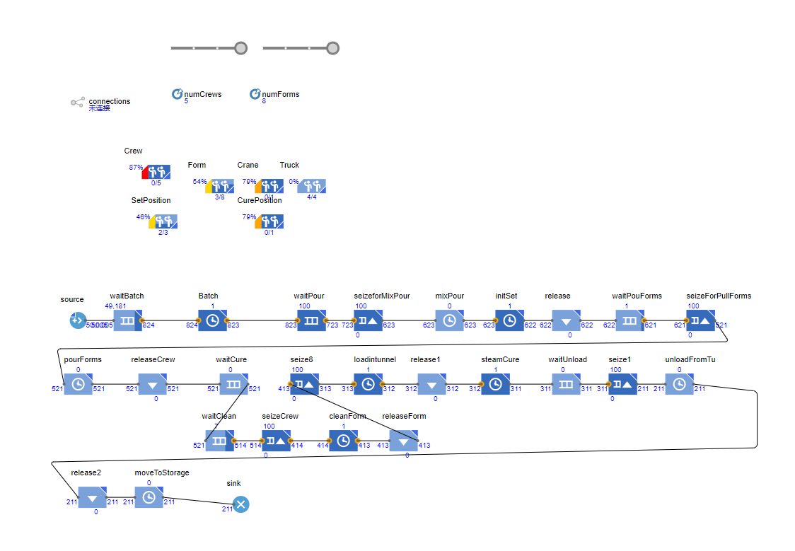

# Question # 1: Take Home
> PANZhiqing 24037665G

- a) Develop EzStrobe and AnyLogic models to simulate the attached precast concrete model. 
- b) Run the models to determine the average precast concrete element’s production.  
- c) Generate complete sets of reports from both programs. 
- d) Select the best alternative. 

## EzStrobe Model
### Model building

Figure 1: EzStrobe model of the precast concrete production line

I manually adjusted the resource values of nodes 15(2,3,4,5) and 24(2,4,6,8) to find the optimal combination (4*4). The combination of crew2 form4 can ensure the minimum waiting time of the two, so I chose this combination, and the cost of this combination is relatively small.

## AnyLogic Model

### Model building

Figure 2: AnyLogic model of the precast concrete production line

However, from the results of the AnyLogic model, the combination of crew=3 and form=2 can make better use of the system resources other than crew and form, thereby improving production efficiency. From the picture in the appendix, it means that no resources are green, that is, no resources are idle. At the same time, this combination does not have obvious bottlenecks, and can better balance the utilization of various resources.

## Conclusion
Therefore, I choose the result of the AnyLogic model, that is, the combination of crew=3 and form=2. This combination can better utilize system resources and improve production efficiency. At the same time, the cost is relatively small.

I visualized the output results of the EzStrobe model for better understanding. I plotted the heatmap of the average waiting time to understand the performance of different combinations. In the following figure, rows and columns represent the values of crew and form, and each subplot represents the average waiting time of a queue. The closer the color is to black, the shorter the idle time of the resource, and the higher the production efficiency.


Figure 3: Heatmap of average waiting time in queues

We can find that as long as the combination is located in the lower left corner of the figure, both Crew and Form can be efficiently utilized, thereby improving production efficiency. Considering the results of the AnyLogic model, we chose the combination of crew=3 and form=2 according to the utilization of other resources.
## Appendix

### Python Code for EzStrobe Output
```python
import re
import pandas as pd
import os
import matplotlib.pyplot as plt
import numpy as np

def parse_simulation_data(file_content):
    """
    解析包含Queue部分的表格数据，返回DataFrame
    """
    lines = file_content.splitlines()
    queue_section = []
    capture = False

    for line in lines:
        if "Queue" in line and "Res" in line:
            # 也保留标题行
            queue_section.append(line.strip())
            capture = True
            continue
        if "Activity" in line and "Cur" in line:
            break
        if capture:
            queue_section.append(line.strip())
    
    # 删除 ====== 分割线
    queue_section = [line for line in queue_section if not re.match(r"=+", line)]
    
    # 解析Queue表格为DataFrame
    if queue_section:
        # print(queue_section)
        return parse_table(queue_section, header_row=0)
    return None

def parse_table(section_data, header_row=0):
    """
    解析段落中的表格数据为 Pandas DataFrame。

    参数:
    section_data (list of str): 包含表格数据的文本列表，每行为一个字符串。
    header_row (int): 表示标题行的索引，默认为 0。

    返回:
    pd.DataFrame: 包含解析结果的 DataFrame。
    """
    if not section_data:
        raise ValueError("输入的表格数据为空。")

    # 提取标题行
    headers = re.split(r"\s{2,}", section_data[header_row].strip())
    
    # 提取数据行
    data_lines = section_data[header_row + 1:]
    data = []

    for line in data_lines:
        if line.strip():  # 跳过空行
            row = re.split(r"\s{2,}", line.strip())
            if len(row) == len(headers):  # 确保数据行列数与标题一致
                data.append(row)
            else:
                # 如果列数不一致，补充空值或截断
                row = row[:len(headers)] + [""] * (len(headers) - len(row))
                data.append(row)
    
    # 检查是否存在有效数据
    if not data:
        raise ValueError("未找到有效的表格数据行。")

    # 将数据转换为 DataFrame
    df = pd.DataFrame(data, columns=headers)
    
    # 尝试将列数据转换为数值类型（若可能）
    for col in df.columns:
        df[col] = pd.to_numeric(df[col], errors='ignore')

    return df

def filePath(numCrew, numForm):
    return os.path.join(PATH, f'crew{numCrew}form{numForm}.txt')

def readData(numCrew, numForm):
    with open(filePath(numCrew, numForm), 'r') as file:
        content = file.read()
    return content

def parseData(numCrew, numForm):
    content = readData(numCrew, numForm)
    queue_data = parse_simulation_data(content)
    return queue_data

def parseDataAll():
    data = {}
    for crew in numCrew:
        for form in numForm:
            data[(crew, form)] = parseData(crew, form)
    return data

## Visualization
# 热力图 每一个队列的平均等待时间
def plotHeatMap(data):
    queueNames = data[(2,2)]['Queue'].values

    # 共 13 个子图 4 * 3 
    fig, axs = plt.subplots(4, 4, figsize=(20, 20))
    fig.suptitle('Heat Map of Average Waiting Time in Queues', fontsize=20)


    for index,Value in enumerate(queueNames):
        # 一个 4 * 4 的矩阵
        tmp = np.zeros((4,4))
        for key, value in data.items():
            tmp[key[0]//2-1][key[1]//2-1] = value['AvWait'][index]

        # 绘制热力图
        ax = axs[index//4][index%4]
        im = ax.imshow(tmp, cmap='hot')

        # 设置标题
        ax.set_title(f'Queue {Value}')

        # 设置坐标轴
        ax.set_xticks(np.arange(4))
        ax.set_yticks(np.arange(4))
        ax.set_xticklabels(numForm)
        ax.set_yticklabels(numCrew)
        ax.set_xlabel('Form')
        ax.set_ylabel('Crew')
    
    # 添加 colorbar
    cbar = fig.colorbar(im, ax=axs.ravel().tolist())
    cbar.set_label('Average Waiting Time')
    
    # 保存图片
    plt.savefig(os.path.join(PATH, 'heatMap.png'))

# 示例文件路径
DIR = os.path.dirname(__file__)
PATH = os.path.join(DIR, '..', 'output')
PATH1 = os.path.join(PATH, 'crew2form2.txt')

numCrew = [2,3,4,5]
numForm = [2,4,6,8]

if __name__ == "__main__":
    # 测试解析所有文件
    data = parseDataAll()

    plotHeatMap(data)
```
### EzStrobe Model Output
```txt
crew=2, form=2
                 Queue   Res    Cur             Tot  AvWait  AvCont  SDCont MinCont  MaxCont
0        a11WaitUnload   ezs    0.0          697.00    2.27    0.02            0.12      0.0
1          a15IdleCrew   ezs    1.0         2103.00   50.05    1.05            0.66      0.0
2         a16WaitClean   ezs    0.0          700.00    0.00    0.00            0.00      0.0
3        a17TruckAvail   ezs    4.0          701.00  500.85    3.51            0.57      2.0
4           a18PosFree   ezs    5.0          705.00  676.94    4.77            0.66      4.0
5         a20WaitBatch   ezs    0.0          717.00   11.31    0.08            0.98      0.0
6          a22WaitPour   ezs   15.0  717.00 2028.04   14.54    1.03            0.00     16.0
7          a23PosAvail   ezs    1.0          703.00  237.10    1.67            0.63      1.0
8         a24AvailForm   ezs    0.0          702.00    0.17    0.00            0.04      0.0
9         a25CraneIdel   ezs    1.0         1398.00   41.66    0.58            0.49      0.0
10  a27BatchPermit ezs  1.00  718.0          101.36    0.73    0.45            0.00      1.0
11  a5WeitPullFormsezs  0.00  700.0            0.00    0.00    0.00            0.00      1.0
12          a7WaitCure   ezs    0.0          700.00    2.84    0.02            0.14      0.0

crew=2, form=4
                 Queue   Res     Cur      Tot  AvWait  AvCont  SDCont MinCont  MaxCont
0        a11WaitUnload   ezs     0.0  1332.00   19.20    0.26            0.45      0.0
1          a15IdleCrew   ezs     0.0  4017.00    4.98    0.20            0.47      0.0
2         a16WaitClean   ezs     0.0  1338.00    1.36    0.02            0.13      0.0
3        a17TruckAvail   ezs     2.0  1334.00  230.25    3.07            0.60      1.0
4           a18PosFree   ezs     3.0  1340.00  119.51    1.60            0.70      0.0
5         a20WaitBatch   ezs     0.0  1350.00    7.43    0.10            0.95      0.0
6          a22WaitPour   ezs     9.0  1350.00  683.42    9.23            0.80      0.0
7          a23PosAvail   ezs     0.0  1341.00   34.15    0.46            0.51      0.0
8         a24AvailForm   ezs     0.0  1341.00    5.02    0.07            0.26      0.0
9         a25CraneIdel   ezs     1.0  2670.00    7.27    0.19            0.40      0.0
10  a27BatchPermit ezs  1.00  1351.0    36.09    0.49    0.50            0.00      1.0
11  a5WeitPullFormsezs  0.00  1338.0     7.90    0.11    0.31            0.00      2.0
12          a7WaitCure   ezs     1.0  1338.00    8.81    0.12            0.32      0.0

crew=2, form=6
                 Queue   Res     Cur      Tot  AvWait  AvCont  SDCont MinCont  MaxCont
0        a11WaitUnload   ezs     0.0  1440.00   33.43    0.48            0.62      0.0
1          a15IdleCrew   ezs     0.0  4347.00    0.82    0.04            0.20      0.0
2         a16WaitClean   ezs     0.0  1447.00   38.46    0.56            0.67      0.0
3        a17TruckAvail   ezs     4.0  1444.00  207.21    2.99            0.72      1.0
4           a18PosFree   ezs     1.0  1448.00   60.58    0.88            0.91      0.0
5         a20WaitBatch   ezs     1.0  1460.00   10.45    0.15            0.99      0.0
6          a22WaitPour   ezs     7.0  1459.00  512.14    7.47            0.92      0.0
7          a23PosAvail   ezs     0.0  1452.00   17.07    0.25            0.46      0.0
8         a24AvailForm   ezs     1.0  1453.00   46.77    0.68            0.64      0.0
9         a25CraneIdel   ezs     1.0  2888.00    4.61    0.13            0.34      0.0
10  a27BatchPermit ezs  1.00  1460.0    30.29    0.44    0.50            0.00      1.0
11  a5WeitPullFormsezs  1.00  1449.0    43.17    0.63    0.73            0.00      3.0
12          a7WaitCure   ezs     0.0  1447.00   16.38    0.24            0.45      0.0

crew=2, form=8
                 Queue   Res     Cur      Tot  AvWait  AvCont  SDCont MinCont  MaxCont
0        a11WaitUnload   ezs     2.0  1454.00   36.99    0.54            0.64      0.0
1          a15IdleCrew   ezs     1.0  4385.00    0.71    0.03            0.19      0.0
2         a16WaitClean   ezs     2.0  1461.00   47.27    0.69            0.76      0.0
3        a17TruckAvail   ezs     2.0  1454.00  205.30    2.99            0.70      1.0
4           a18PosFree   ezs     0.0  1459.00   52.21    0.76            0.91      0.0
5         a20WaitBatch   ezs     0.0  1470.00    9.96    0.15            1.02      0.0
6          a22WaitPour   ezs     6.0  1470.00  489.31    7.19            0.97      0.0
7          a23PosAvail   ezs     0.0  1464.00   14.99    0.22            0.45      0.0
8         a24AvailForm   ezs     2.0  1466.00  166.61    2.44            0.80      0.0
9         a25CraneIdel   ezs     0.0  2911.00    4.22    0.12            0.33      0.0
10  a27BatchPermit ezs  1.00  1471.0    30.20    0.44    0.50            0.00      1.0
11  a5WeitPullFormsezs  0.00  1461.0    48.27    0.71    0.82            0.00      3.0
12          a7WaitCure   ezs     2.0  1461.00   19.99    0.29            0.49      0.0

crew=3, form=2
                 Queue   Res    Cur             Tot  AvWait  AvCont  SDCont MinCont  MaxCont
0        a11WaitUnload   ezs    0.0          698.00    1.32    0.01            0.10      0.0
1          a15IdleCrew   ezs    3.0         2106.00   97.54    2.05            0.77      1.0
2         a16WaitClean   ezs    1.0          701.00    0.00    0.00            0.00      0.0
3        a17TruckAvail   ezs    3.0          701.00  500.31    3.51            0.61      2.0
4           a18PosFree   ezs    6.0          706.00  676.63    4.78            0.74      4.0
5         a20WaitBatch   ezs    0.0          717.00   12.17    0.09            1.00      0.0
6          a22WaitPour   ezs   15.0  717.00 2026.34   14.53    1.08            0.00     16.0
7          a23PosAvail   ezs    2.0          704.00  236.90    1.67            0.72      1.0
8         a24AvailForm   ezs    0.0          702.00    0.17    0.00            0.04      0.0
9         a25CraneIdel   ezs    1.0         1399.00   41.63    0.58            0.49      0.0
10  a27BatchPermit ezs  1.00  718.0          101.53    0.73    0.44            0.00      1.0
11  a5WeitPullFormsezs  0.00  701.0            0.00    0.00    0.00            0.00      1.0
12          a7WaitCure   ezs    1.0          701.00    4.08    0.03            0.17      0.0

crew=3, form=4
                 Queue   Res     Cur      Tot  AvWait  AvCont  SDCont MinCont  MaxCont
0        a11WaitUnload   ezs     0.0  1369.00   16.08    0.22            0.43      0.0
1          a15IdleCrew   ezs     2.0  4129.00   27.73    1.14            0.76      0.0
2         a16WaitClean   ezs     1.0  1375.00    0.00    0.00            0.01      0.0
3        a17TruckAvail   ezs     2.0  1371.00  221.69    3.04            0.62      1.0
4           a18PosFree   ezs     2.0  1376.00  106.52    1.47            0.72      0.0
5         a20WaitBatch   ezs     0.0  1387.00    7.98    0.11            0.94      0.0
6          a22WaitPour   ezs     9.0  1387.00  653.34    9.06            0.79      0.0
7          a23PosAvail   ezs     0.0  1378.00   28.02    0.39            0.53      0.0
8         a24AvailForm   ezs     0.0  1378.00    5.89    0.08            0.28      0.0
9         a25CraneIdel   ezs     0.0  2743.00    6.25    0.17            0.38      0.0
10  a27BatchPermit ezs  1.00  1388.0    34.03    0.47    0.50            0.00      1.0
11  a5WeitPullFormsezs  0.00  1375.0     0.01    0.00    0.01            0.00      1.0
12          a7WaitCure   ezs     1.0  1375.00    9.09    0.12            0.34      0.0

crew=3, form=6
                 Queue   Res     Cur      Tot  AvWait  AvCont  SDCont MinCont  MaxCont
0        a11WaitUnload   ezs     1.0  1564.00   26.39    0.41            0.52      0.0
1          a15IdleCrew   ezs     2.0  4718.00   18.74    0.88            0.90      0.0
2         a16WaitClean   ezs     0.0  1571.00    2.46    0.04            0.19      0.0
3        a17TruckAvail   ezs     3.0  1566.00  185.53    2.91            0.59      1.0
4           a18PosFree   ezs     0.0  1570.00   24.43    0.38            0.67      0.0
5         a20WaitBatch   ezs     1.0  1582.00    7.33    0.12            0.97      0.0
6          a22WaitPour   ezs     7.0  1581.00  454.44    7.18            0.79      0.0
7          a23PosAvail   ezs     0.0  1574.00    0.78    0.01            0.12      0.0
8         a24AvailForm   ezs     2.0  1576.00   88.87    1.40            0.68      0.0
9         a25CraneIdel   ezs     0.0  3133.00    1.99    0.06            0.24      0.0
10  a27BatchPermit ezs  1.00  1582.0    25.37    0.40    0.49            0.00      1.0
11  a5WeitPullFormsezs  0.00  1571.0     5.50    0.09    0.28            0.00      1.0
12          a7WaitCure   ezs     1.0  1571.00   15.01    0.24            0.43      0.0

crew=3, form=8
                 Queue   Res     Cur      Tot  AvWait  AvCont  SDCont MinCont  MaxCont
0        a11WaitUnload   ezs     1.0  1564.00   25.71    0.40            0.51      0.0
1          a15IdleCrew   ezs     1.0  4719.00   19.04    0.90            0.91      0.0
2         a16WaitClean   ezs     0.0  1571.00    2.85    0.04            0.21      0.0
3        a17TruckAvail   ezs     3.0  1566.00  185.86    2.91            0.60      1.0
4           a18PosFree   ezs     0.0  1571.00   25.04    0.39            0.68      0.0
5         a20WaitBatch   ezs     0.0  1582.00    8.01    0.13            1.00      0.0
6          a22WaitPour   ezs     7.0  1582.00  455.29    7.20            0.77      0.0
7          a23PosAvail   ezs     0.0  1575.00    0.88    0.01            0.13      0.0
8         a24AvailForm   ezs     4.0  1579.00  215.56    3.40            0.71      2.0
9         a25CraneIdel   ezs     1.0  3135.00    2.04    0.06            0.24      0.0
10  a27BatchPermit ezs  1.00  1583.0    24.92    0.39    0.49            0.00      1.0
11  a5WeitPullFormsezs  0.00  1572.0     5.77    0.09    0.29            0.00      1.0
12          a7WaitCure   ezs     0.0  1571.00   13.37    0.21            0.41      0.0

crew=4, form=2
                 Queue   Res    Cur             Tot  AvWait  AvCont  SDCont MinCont  MaxCont
0        a11WaitUnload   ezs    0.0          702.00    1.99    0.01            0.12      0.0
1          a15IdleCrew   ezs    3.0         2118.00  144.46    3.06            0.72      2.0
2         a16WaitClean   ezs    0.0          704.00    0.00    0.00            0.00      0.0
3        a17TruckAvail   ezs    4.0          706.00  496.96    3.51            0.59      2.0
4           a18PosFree   ezs    6.0          710.00  669.62    4.75            0.70      4.0
5         a20WaitBatch   ezs    1.0          722.00   10.65    0.08            0.93      0.0
6          a22WaitPour   ezs   15.0  721.00 2013.05   14.51    1.00            0.00     16.0
7          a23PosAvail   ezs    2.0          708.00  234.28    1.66            0.67      1.0
8         a24AvailForm   ezs    0.0          706.00    0.15    0.00            0.04      0.0
9         a25CraneIdel   ezs    1.0         1407.00   41.19    0.58            0.49      0.0
10  a27BatchPermit ezs  1.00  722.0          100.55    0.73    0.45            0.00      1.0
11  a5WeitPullFormsezs  0.00  705.0            0.00    0.00    0.00            0.00      1.0
12          a7WaitCure   ezs    0.0          704.00    3.01    0.02            0.14      0.0

crew=4, form=4
                 Queue   Res     Cur      Tot  AvWait  AvCont  SDCont MinCont  MaxCont
0        a11WaitUnload   ezs     1.0  1366.00   15.12    0.21            0.41      0.0
1          a15IdleCrew   ezs     3.0  4121.00   52.10    2.15            0.77      0.0
2         a16WaitClean   ezs     0.0  1372.00    0.00    0.00            0.00      0.0
3        a17TruckAvail   ezs     4.0  1369.00  222.28    3.04            0.61      1.0
4           a18PosFree   ezs     1.0  1373.00  109.22    1.50            0.72      0.0
5         a20WaitBatch   ezs     0.0  1385.00    7.91    0.11            0.96      0.0
6          a22WaitPour   ezs    10.0  1384.00  658.48    9.11            0.81      0.0
7          a23PosAvail   ezs     1.0  1375.00   28.58    0.39            0.54      0.0
8         a24AvailForm   ezs     1.0  1375.00    6.34    0.09            0.29      0.0
9         a25CraneIdel   ezs     0.0  2737.00    6.58    0.18            0.38      0.0
10  a27BatchPermit ezs  0.00  1385.0    34.29    0.47    0.50            0.00      1.0
11  a5WeitPullFormsezs  0.00  1372.0     0.00    0.00    0.00            0.00      1.0
12          a7WaitCure   ezs     0.0  1372.00    8.40    0.12            0.32      0.0

crew=4, form=6
                 Queue   Res     Cur      Tot  AvWait  AvCont  SDCont MinCont  MaxCont
0        a11WaitUnload   ezs     0.0  1565.00   26.93    0.42            0.52      0.0
1          a15IdleCrew   ezs     3.0  4722.00   39.78    1.88            1.16      0.0
2         a16WaitClean   ezs     0.0  1572.00    0.60    0.01            0.10      0.0
3        a17TruckAvail   ezs     2.0  1567.00  185.47    2.91            0.61      1.0
4           a18PosFree   ezs     2.0  1573.00   23.17    0.36            0.68      0.0
5         a20WaitBatch   ezs     0.0  1583.00    7.77    0.12            0.98      0.0
6          a22WaitPour   ezs     8.0  1583.00  452.07    7.16            0.80      0.0
7          a23PosAvail   ezs     0.0  1575.00    0.18    0.00            0.08      0.0
8         a24AvailForm   ezs     2.0  1577.00   94.22    1.49            0.78      0.0
9         a25CraneIdel   ezs     1.0  3137.00    1.86    0.06            0.23      0.0
10  a27BatchPermit ezs  1.00  1584.0    25.38    0.40    0.49            0.00      1.0
11  a5WeitPullFormsezs  0.00  1572.0     1.44    0.02    0.15            0.00      1.0
12          a7WaitCure   ezs     1.0  1572.00   18.70    0.29            0.47      0.0

crew=4, form=8
                 Queue   Res     Cur      Tot  AvWait  AvCont  SDCont MinCont  MaxCont
0        a11WaitUnload   ezs     2.0  1568.00   27.61    0.43            0.52      0.0
1          a15IdleCrew   ezs     3.0  4731.00   39.75    1.88            1.20      0.0
2         a16WaitClean   ezs     0.0  1575.00    0.85    0.01            0.12      0.0
3        a17TruckAvail   ezs     3.0  1569.00  185.04    2.90            0.59      1.0
4           a18PosFree   ezs     0.0  1574.00   21.48    0.34            0.67      0.0
5         a20WaitBatch   ezs     0.0  1585.00    7.51    0.12            1.00      0.0
6          a22WaitPour   ezs     7.0  1585.00  446.76    7.08            0.82      0.0
7          a23PosAvail   ezs     0.0  1578.00    0.26    0.00            0.09      0.0
8         a24AvailForm   ezs     4.0  1582.00  219.47    3.47            0.82      2.0
9         a25CraneIdel   ezs     0.0  3140.00    1.67    0.05            0.22      0.0
10  a27BatchPermit ezs  1.00  1586.0    25.33    0.40    0.49            0.00      1.0
11  a5WeitPullFormsezs  0.00  1575.0     1.96    0.03    0.17            0.00      1.0
12          a7WaitCure   ezs     1.0  1575.00   21.33    0.34            0.49      0.0

crew=5, form=2
                 Queue   Res    Cur             Tot  AvWait  AvCont  SDCont MinCont  MaxCont
0        a11WaitUnload   ezs    0.0          696.00    2.29    0.02            0.13      0.0
1          a15IdleCrew   ezs    4.0         2102.00  192.71    4.05            0.69      3.0
2         a16WaitClean   ezs    0.0          699.00    0.00    0.00            0.00      0.0
3        a17TruckAvail   ezs    4.0          700.00  502.12    3.51            0.58      2.0
4           a18PosFree   ezs    5.0          704.00  678.45    4.78            0.68      4.0
5         a20WaitBatch   ezs    1.0          716.00   11.56    0.08            0.99      0.0
6          a22WaitPour   ezs   15.0  715.00 2035.16   14.55    1.05            0.00     16.0
7          a23PosAvail   ezs    2.0          702.00  237.99    1.67            0.65      1.0
8         a24AvailForm   ezs    0.0          700.00    0.16    0.00            0.04      0.0
9         a25CraneIdel   ezs    1.0         1396.00   41.58    0.58            0.49      0.0
10  a27BatchPermit ezs  1.00  716.0          101.91    0.73    0.44            0.00      1.0
11  a5WeitPullFormsezs  0.00  699.0            0.00    0.00    0.00            0.00      1.0
12          a7WaitCure   ezs    0.0          699.00    3.17    0.02            0.15      0.0

crew=5, form=4
                 Queue   Res     Cur      Tot  AvWait  AvCont  SDCont MinCont  MaxCont
0        a11WaitUnload   ezs     0.0  1372.00   15.79    0.22            0.42      0.0
1          a15IdleCrew   ezs     4.0  4143.00   76.02    3.15            0.75      1.0
2         a16WaitClean   ezs     1.0  1379.00    0.00    0.00            0.00      0.0
3        a17TruckAvail   ezs     3.0  1375.00  221.12    3.04            0.62      1.0
4           a18PosFree   ezs     2.0  1380.00  105.56    1.46            0.73      0.0
5         a20WaitBatch   ezs     0.0  1391.00    8.42    0.12            1.01      0.0
6          a22WaitPour   ezs     9.0  1391.00  649.77    9.04            0.83      0.0
7          a23PosAvail   ezs     0.0  1382.00   27.07    0.37            0.53      0.0
8         a24AvailForm   ezs     0.0  1382.00    5.76    0.08            0.28      0.0
9         a25CraneIdel   ezs     1.0  2751.00    6.32    0.17            0.38      0.0
10  a27BatchPermit ezs  1.00  1392.0    33.87    0.47    0.50            0.00      1.0
11  a5WeitPullFormsezs  0.00  1379.0     0.00    0.00    0.00            0.00      1.0
12          a7WaitCure   ezs     1.0  1379.00    8.54    0.12            0.33      0.0

crew=5, form=6
                 Queue   Res     Cur      Tot  AvWait  AvCont  SDCont MinCont  MaxCont
0        a11WaitUnload   ezs     0.0  1567.00   24.93    0.39            0.51      0.0
1          a15IdleCrew   ezs     2.0  4730.00   60.69    2.87            1.25      0.0
2         a16WaitClean   ezs     0.0  1575.00    0.22    0.00            0.06      0.0
3        a17TruckAvail   ezs     3.0  1570.00  184.78    2.90            0.60      1.0
4           a18PosFree   ezs     1.0  1575.00   24.72    0.39            0.68      0.0
5         a20WaitBatch   ezs     1.0  1586.00    8.93    0.14            1.06      0.0
6          a22WaitPour   ezs     7.0  1585.00  449.81    7.13            0.86      0.0
7          a23PosAvail   ezs     0.0  1578.00    0.17    0.00            0.08      0.0
8         a24AvailForm   ezs     1.0  1579.00   94.81    1.50            0.80      0.0
9         a25CraneIdel   ezs     0.0  3141.00    1.94    0.06            0.24      0.0
10  a27BatchPermit ezs  1.00  1586.0    24.94    0.40    0.49            0.00      1.0
11  a5WeitPullFormsezs  0.00  1575.0     0.37    0.01    0.08            0.00      1.0
12          a7WaitCure   ezs     1.0  1575.00   20.94    0.33            0.51      0.0

crew=5, form=8
                 Queue   Res     Cur      Tot  AvWait  AvCont  SDCont MinCont  MaxCont
0        a11WaitUnload   ezs     1.0  1568.00   25.21    0.40            0.51      0.0
1          a15IdleCrew   ezs     3.0  4730.00   60.70    2.87            1.33      0.0
2         a16WaitClean   ezs     0.0  1574.00    0.23    0.00            0.06      0.0
3        a17TruckAvail   ezs     3.0  1570.00  184.93    2.90            0.62      1.0
4           a18PosFree   ezs     1.0  1575.00   24.32    0.38            0.68      0.0
5         a20WaitBatch   ezs     0.0  1586.00    7.84    0.12            0.97      0.0
6          a22WaitPour   ezs     7.0  1585.00  450.39    7.14            0.82      0.0
7          a23PosAvail   ezs     0.0  1578.00    0.13    0.00            0.07      0.0
8         a24AvailForm   ezs     4.0  1582.00  221.06    3.50            0.87      2.0
9         a25CraneIdel   ezs     1.0  3142.00    1.94    0.06            0.24      0.0
10  a27BatchPermit ezs  0.00  1586.0    25.40    0.40    0.49            0.00      1.0
11  a5WeitPullFormsezs  0.00  1575.0     0.37    0.01    0.08            0.00      1.0
12          a7WaitCure   ezs     0.0  1574.00   21.61    0.34            0.51      0.0
```
### AnyLogic Model Output

<!-- |/|2|4|6|8|
|---|---|---|---|---|
|2|||||
|3|||||
|4|||||
|5||||| -->


Figure 1: Crew=2, Form=2


Figure 2: Crew=2, Form=4


Figure 3: Crew=2, Form=6


Figure 4: Crew=2, Form=8


Figure 5: Crew=3, Form=2


Figure 6: Crew=3, Form=4


Figure 7: Crew=3, Form=6


Figure 8: Crew=3, Form=8


Figure 9: Crew=4, Form=2


Figure 10: Crew=4, Form=4


Figure 11: Crew=4, Form=6


Figure 12: Crew=4, Form=8


Figure 13: Crew=5, Form=2


Figure 14: Crew=5, Form=4


Figure 15: Crew=5, Form=6


Figure 16: Crew=5, Form=8


