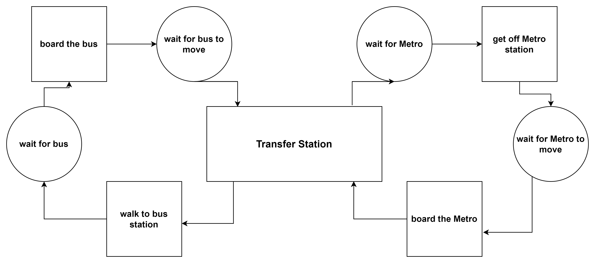

# Homework 1

## Think about an operation in your domain.

Urban Transportation (considering Bus and Metro systems, as they have defined stations and routes.)

## List all the tasks in this operation:
1. Walk to a station.
2. Wait for a specific vehicle (Bus or Metro).
3. Board the vehicle.
4. Wait while the vehicle moves.
5. Get off at the destination station.

## List the resources required in the tasks/operation:
People (can be categorized by their destinations).

## Draw the number of cycles in each operation:
For example, in a two-cycle system where a person travels from a bus station to a metro station, you can break down the process as follows:

- First cycle: Bus journey
    1. Walk to the bus station.
    2. Wait for the bus.
    3. Board the bus.
    4. Wait for the bus to move.
    5. Get off at the metro station.

- Second cycle: Metro journey
    1. Walk to the metro station.
    2. Wait for the metro.
    3. Board the metro.
    4. Wait for the metro to move.
    5. Get off at the destination.

In this system, the process from one station to another involves two cycles, one for the bus and one for the metro, with each cycle repeating a similar set of tasks.

