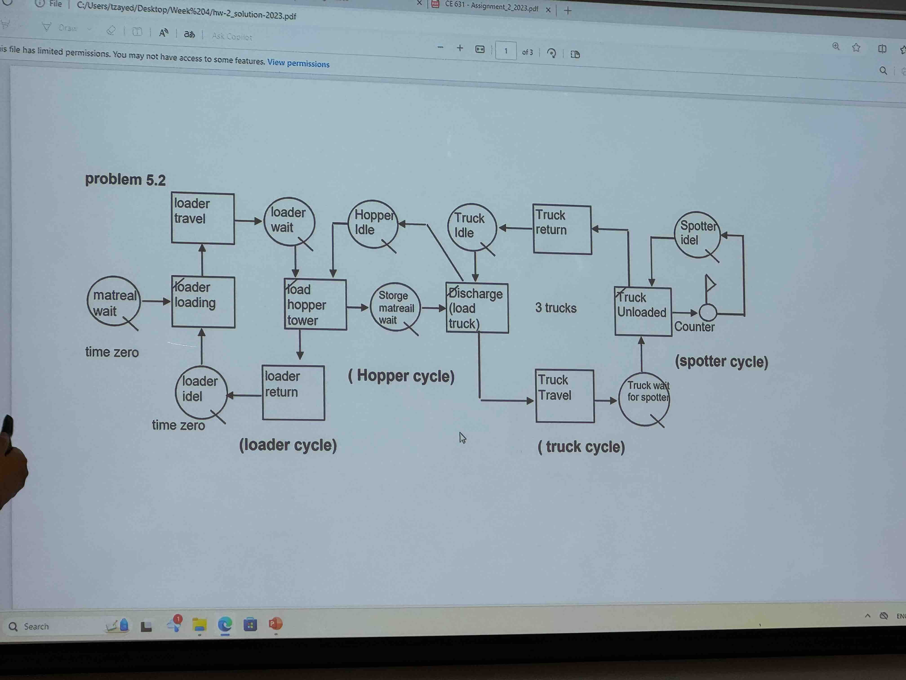
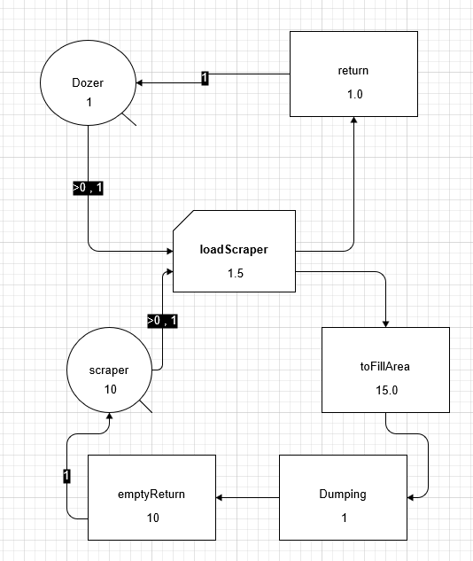

# HomeWork 2
1. Three trucks haul material from a loading tower to an airfield construction job. At the fill (i.e., airfield) a spotter shows each truck where to dump. After the trucks dump material, they return to the loading tower. A front loader is used to load the tower. The tower can hold up to three loads. Draw a circle-and-square (CYCLONE) diagram of this system. Indicate all cycles and where the units in the system would be initialized at time zero.
    
2. A number of tractor scrapers are being push-loaded by one “pusher'' dozer. The average "push" time is 1.5 min. After pushing a scraper the dozer returns to the "push point" to await another scraper. If another scraper is available to push, the dozer engages the booster bar and resumes pushing. The return time to push point is 1.0 min. After loading the average travel time for a scraper to the fill area is 15.0 min. The average empty return time is 10.0 min. Dumping the material at the construction site takes 1.0 min. Draw a model of this system using circle-and-square notation (include a COUNTER). What is the balance point of the system?(若计算出的有小数，应该从成本的角度考虑，成本较高的设备不应该闲置)
   
   - dozer work cycle duration 27.5 min
   - scraper work cycle duration 2.5 
   - balance number of scraper 27.5 / 2.5 = 11
   - simulation output : 
```
    Queue          Res              Cur       Tot  AvWait    AvCont    SDCont MinCont   MaxCont
    ===========================================================================================
    Dozer          ezs             1.00  36365.00    0.25      0.09      0.29    0.00      1.00
    scraper        ezs             1.00  36365.00    0.00      0.00      0.08    0.00     10.00


    Activity        Cur     Tot     1stSt     LstSt   AvDur  SDDur   MinD    MaxD   AvInt  SDInt    MinI    MaxI
    ============================================================================================================
    Dumping           0   36359     16.50  99999.00    1.00   0.00   1.00    1.00    2.75   0.75    2.50    5.00
    emptyReturn       4   36359     17.50 100000.00   10.00   0.00  10.00   10.00    2.75   0.75    2.50    5.00
    loadScraper       0   36364      0.00  99997.50    1.50   0.00   1.50    1.50    2.75   0.75    2.50    5.00
    return            0   36364      1.50  99999.00    1.00   0.00   1.00    1.00    2.75   0.75    2.50    5.00
    toFillArea        5   36364      1.50  99999.00   15.00   0.00  15.00   15.00    2.75   0.75    2.50    5.00


    Contents of the Future Events List at simulation time 100000.00

    Instance            Start     End       
    ========================================
    toFillArea(36359)   99986.50  100001.50 
    emptyReturn(36355)  99992.50  100002.50 
    emptyReturn(36356)  99995.00  100005.00 
    toFillArea(36360)   99991.50  100006.50 
    emptyReturn(36357)  99997.50  100007.50 
    toFillArea(36361)   99994.00  100009.00 
    emptyReturn(36358)  100000.00 100010.00 
    toFillArea(36362)   99996.50  100011.50 
    toFillArea(36363)   99999.00  100014.00 


    Total Number of Named Objects : 26
    Total Number of Variables : 113
    Total Number of Statements : 11


    Integral Stat   Ave. Wait
    =========================
```
    .png)

3. A crane is working atop a high-rise building. It is required to place twenty 2-yd3 buckets of concrete. After this it is diverted and lifts 10 pieces of form work into position. Then it returns to lift 20 more buckets of concrete. The crane keeps alternating between placing concrete and formwork in this fashion. Draw a CYCLONE model of a system which will reroute the crane as described above.
   

4. A forklift is used to off-load precast sections for a building facade. After off-loading 20 sections, the forklift is rerouted to the brick storage to offload brick pallets. Draw a CYCLONE model of a system that will reroute the fork lift at the proper time.

5. In Problem 8.5, assume that trucks are not held at the storage yard but move to the job site directly. At the job site, there are two off-loading positions. Incoming trucks are delayed at a holding area until one of the two off-loading positions becomes available. As an off-loading position becomes available, the next truck moves forward, off-loads, and departs. Model this slightly modified situation.

    (8.5 The process under consideration involves the movement of precast double-T parking decks from a storage yard to the job site where a parking garage is being constructed. The double-T precast elements are moved using low-bed trucks. Two elements can be loaded on each truck. Each section is lifted into position at the job site using a tower crane. Because of the congested nature of the job site, trucks must wait in the street while being off-loaded. Only two trucks can wait at a time. When a truck has been unloaded, a signal is sent to the storage yard to release the next truck. Model the precast element described).

6. class work
   