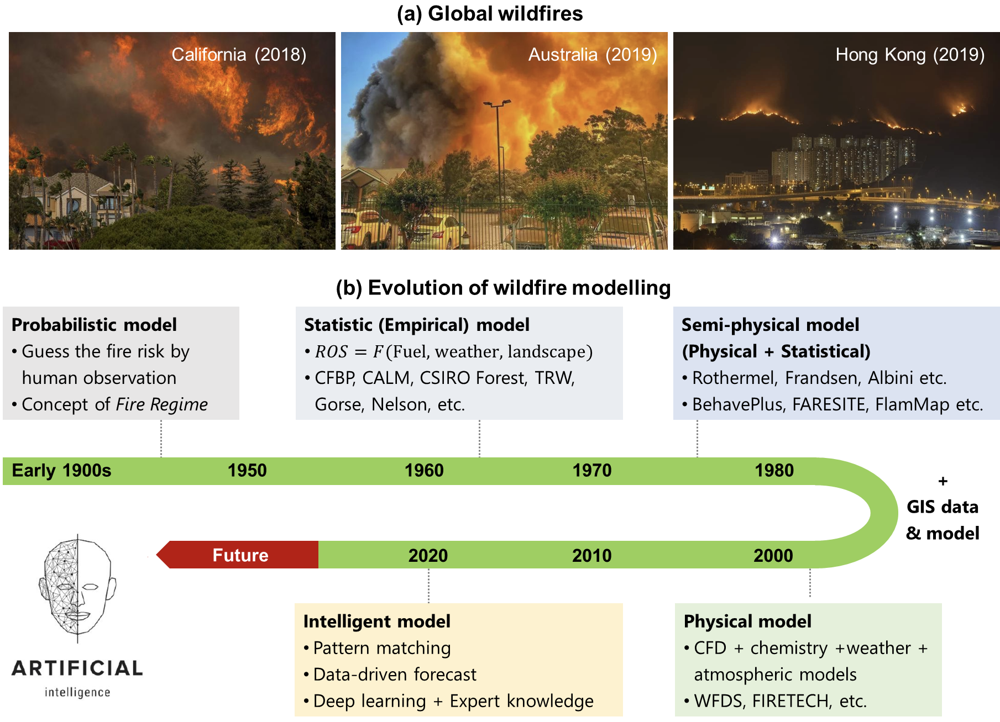
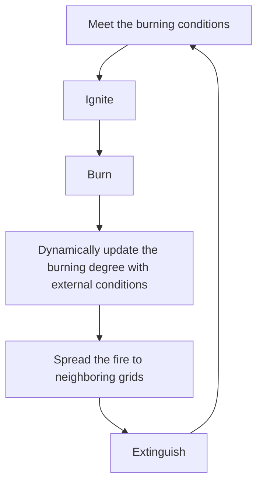
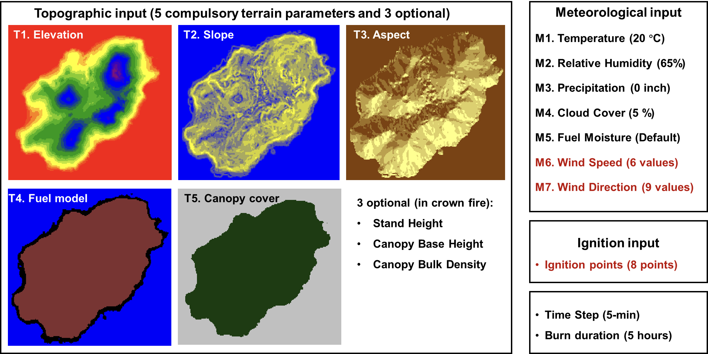

# midterm  progress  report
> ZhiqingPAN24037665g

## Introduction
Fire has been a long-existent phenomenon on Earth and an essential part of different ecosystems (Running 2006; Belcher 2013). With the rise of human civilization and the expansion of living space, humans are gradually occupying the wildlands to create more urban areas. Meanwhile, our human activities have caused more and more wildfires and increased the frequency of extreme wildfires. Once a wildfire occurs, it primarily affects the residents who live in the emerging wildland-urban interface (WUI) (Theobald and Romme 2007; Gill and Stephens 2009). 

Hong Kong is a highly populated modern city with over 4,000 skyscrapers, but it also has ~70% of its land covered by woodland, shrubland, and wetland (Lee et al. 2017). Therefore, it is a typical WUI that is constantly threatened by wildfires. According to the data from Hong Kong Fire Services Department (‘Hong Kong Fire Services Department - Access to Information’ 2021), about 1,000 wildfires (or hill fires) are reported annually. Over 80% of wildfires witness a burning area of less than 1,000 m2 and a burning time of 24 h because of significant firefighting efforts. Still, some wildfires spread to nearby high-population urban areas that cause significant safety issues and air pollution. 

Wildfire behavior is a complex and dynamic phenomenon influenced by various factors, including the characteristics of the fuel, topography, weather conditions, and local landscape. As such, fire spread is not always linear or steady-state, and predicting its course can be challenging. In particular, sudden changes in weather conditions or the ignition of new fires can cause rapid shifts in the pattern of wildfire spread, potentially breaching established firebreaks and endangering previously safe areas. Therefore, accurate forecasting of real-time or short-term trends in fire spread is essential for effective wildfire management, particularly in wildland-urban interface (WUI) zones. Real-time fire spread forecasts can aid fire services in allocating resources, planning evacuations, and implementing other emergency response measures by predicting a fire's expected trajectory and intensity. These predictions can also assist residents in making informed decisions about their safety and help to prevent loss of life and property damage.

## Literature Review
Researchers have attempted to simulate wildfires and forecast their spread behaviors since the 1950s or even earlier. In the early days, most models were simple and probabilistic, based on limited human observation and experience.​ These models mainly assessed the wildfire risk but could not predict wildfire spread (Skinner and Chang 1996). Later in the 1970s, more understanding of wildfire dynamics was introduced to the mathematical model. Notably, Rothermel proposed a widely used semi-physical formula that considers different factors of fire, fuel, landscape, and weather to calculate the wildfire spread (Rothermel 1972).​ In the 1990s, several software tools had been developed to program these semi-physical models and environment parameters to predict 2-D wildland fire spread. For example, FARSITE (later becoming a part of FlamMap) coded Rothermel's equation to simulate and visualize wildfire propagation (Finney 1998). The running of FARSITE needs input from the Geography Information System (GIS), but the data from wildland fuel, weather, and landscape are often challenging to acquire accurately.

Since the 2000s, several numerical software was developed for physics-based fire modellings, such as HIGRAD/FIRETEC and Wildland Fire Dynamics Simulator (WFDS) (Hoffman et al. 2016). These tools are based on computational fluid dynamics (CFD) that can solve the atmospheric flow field and ground boundary flow near the fire (Anderson and Wendt 1995). These tools make wildfire simulation exquisite but consume considerable time and require high computation costs. Overall, the wildfire modelling method is evolving from statistics-based models to physical-based models. Nevertheless, all these computational tools are too slow to give real-time forecasts of wildland fire development. For example, forecasting the wildfire front in a few minutes often takes CFD-based software to run hours, so these kinds of wildfire simulations neither help guide the wildfire emergency response nor plan the prescribed burning.

To overcome the above issues, more recently, new artificial intelligence (AI) models have been proposed for fire forecast (Wang et al. 2022; Wu et al. 2022; Zhang et al. 2022), including wildfire forecast, which is an emerging research topic (Radke et al. 2019; Allaire et al. 2022; Jiang et al. 2022). The mathematic-based computation can be switched into a data-driven matchup in the database, where AI models calculate the mathematical relations among different parameters within seconds. Many researchers optimized the traditional models with AI models to increase the accuracy of forecasts (Radke et al. 2019; Zhou et al. 2020). Also, deep learning was widely used to explain and predict the wildfire spread rate (Zhai et al. 2020; Storey et al. 2021; Li, Lin, et al. 2022). Deep learning models were also adopted to map and forecast the wildfire risk possibility (Jaafari et al. 2019; Le et al. 2020; Allaire et al. 2022). Meanwhile, the AI-based models primarily decreased the computation time and made the long-term forecast possible in simulating wildfires (Hodges and Lattimer 2019; Sung et al. 2021; Li, Zhang, et al. 2022).

## Equipment and Steps Description
我们可以使用网格划分的方式来模拟火灾蔓延，每一个网格代表一个小区域，存放0~1之间的数值，表示这个区域的燃烧程度。0表示没有燃烧（或自灭），1表示最大燃烧。现在，对于某一单独的网格，从满足着火条件而着火到燃烧完全而熄灭，我们可以用一个简单的循环来模拟。

    满足燃烧条件 -> 着火 -> 燃烧 -> 随着外界条件动态更新燃烧程度 -> 向邻近网格传播火势 -> 熄灭

在每一个时间步，我们可以根据风向、风速、地形、植被等因素的影响计算出火焰的蔓延方向和速度，然后更新每一个网格的燃烧程度。这样，我们就可以模拟出火灾的蔓延过程。对于每一个网格的燃烧时间，我们会使用蒙特卡洛模拟的方法来模拟。我们可以根据历史数据，计算出植被的燃烧时间的概率分布，然后根据这个概率分布来模拟每一个网格的燃烧时间。对于火势传播条件，我们会综合考虑风向、风速、地形、植被等因素。我们可以根据这些因素来计算出每一个网格的火势传播概率，然后根据这个概率来控制火势的传播。

We can use the grid division method to simulate the spread of the fire, where each grid represents a small area and stores a value between 0 and 1, indicating the degree of burning in that area. 0 indicates no burning (or self-extinguishing), and 1 indicates maximum burning. Now, for a single grid, from meeting the conditions for ignition to complete burning and extinguishing, we can simulate it with a simple loop.
    

At each time step, we can calculate the direction and speed of the flame spread based on factors such as wind direction, wind speed, terrain, and vegetation, and then update the burning degree of each grid. In this way, we can simulate the spread of the fire. For the burning time of each grid, we will use the Monte Carlo simulation method to simulate it. We can calculate the probability distribution of the burning time of the vegetation based on historical data and then simulate the burning time of each grid based on this probability distribution. For the fire spread conditions, we will consider factors such as wind direction, wind speed, terrain, and vegetation. We can calculate the probability of fire spread for each grid based on these factors and then control the spread of the fire based on this probability.

## Factors that Affect Productivity

正如我们上文提到的，野火燃烧过程是一个复杂的动态过程，并且我们已经就单一格网构建了简易的燃烧模型。从静态角度考虑，当前格网的燃烧潜力至少受到以下因素的影响：
1. 地表可燃物储量: 主要包括植被类型、植被密度、植被高度、植被湿度等。该部分决定了燃烧模型的初始条件(燃料量及品质),是首先需要调查并建模的部分。
2. 地形: 主要包括坡度、坡向、海拔等。对于同一植被类型，不同地形条件下的燃烧速度和方向可能会有很大差异,尤其是在山区。

从燃烧过程的动态角度考虑：
1. 气象条件: 主要包括风速、风向、温度等。这些因素会在燃烧的过程中不断影响火势的传播速度和方向。从模拟算法的角度讲,在 "burning with changed outer conditions" 这一步骤中,模型会不断接受外界参数并不断,更新当前格网的燃烧程度,直到当前格网完全熄灭。在格网间传播火势时,会根据外界参数计算传播概率,并根据概率控制火势的传播。
2. 火灾扑救措施: 主要包括扑救人员,扑救设备辆等。对于动态的扑救行为,我们可以建立新的循环;对于隔离带等静态设施,则可以作为地形的一部分,在模拟中动态更新。

As mentioned above, the wildfire burning process is a complex dynamic process, and we have built a simple burning model cycle for a single grid. From a static perspective, the burning potential of the current grid is at least affected by the following factors:
1. Surface combustible reserves: mainly including vegetation type, vegetation density, vegetation height, vegetation humidity, etc. This part determines the initial conditions of the burning model (fuel quantity and quality) and is the first part that needs to be investigated and modeled.
2. Terrain: mainly including slope, aspect, altitude, etc. For the same vegetation type, the burning speed and direction under different terrain conditions may vary greatly, especially in mountainous areas.

From the dynamic perspective of the burning process:
1. Meteorological conditions: mainly including wind speed, wind direction, temperature, etc. These factors will continuously affect the spread speed and direction of the fire during the burning process. From the perspective of the simulation algorithm, in the "burning with changed outer conditions" step, the model will continuously accept external parameters and continuously update the burning degree of the current grid until the current grid is completely extinguished. When spreading the fire between grids, the spread probability will be calculated based on external parameters and burning grids spacial pattern, and the spread of the fire will be controlled based on this probability.
3. Firefighting measures: mainly including firefighting personnel, firefighting equipment, etc. For dynamic firefighting actions, we can establish a new loop; for static facilities such as firebreaks, they can be part of the terrain and dynamically updated in the simulation.

## Data Collection Procedure of the Selected Project
从 GIS 数据采集角度讲, 我们已经或正在收集的数据主要包括:
1. 火灾历史数据: 我们将首先使用香港消防处的火灾历史数据来确定香港地区总体野火火灾的频率和规模,并结合这些信息筛选潜在的研究区域。
2. 研究区域的植被数据: 我们认为某一区域的植被是野火的主要燃料,所以植被的种类,密度,高度,湿度等信息是重要的初始条件。我们综合使用遥感图像(尤其是近红外波段),香港政府的植被数据等,来获取研究区域的植被信息,并通过 GIS 手段将其转化为分辨率为5米的燃料栅格数据。
3. 研究区域的气象数据: 我们下载了香港气象局的气象数据近一年的气象数据,并对研究区域的温度,湿度,风速,风向等信息进行了统计分析,获取各个气象参数的概率分布,以用于蒙特卡洛模拟并获得合适时间步的气象模拟数据。
4. 研究区域的地形数据: 从香港政府的开源数据网站直接下载研究区域的地形数据,随后使用 ArcGIS 10.2 软件对这些数据进行后处理,得到精度为5米的地形数据。地形数据包括高程,坡度和坡向等信息,这些信息将用于模拟火灾蔓延过程中的地形条件。

From the perspective of GIS data collection, the data we have collected or are collecting mainly include:
1. Fire History Data: We will first use the fire history data from the Hong Kong Fire Services Department to determine the frequency and scale of wildfires in the Hong Kong area and select potential study areas based on this information.
2. Vegetation Data of the Study Area: We consider the vegetation in a region to be the primary fuel for wildfires, so information such as vegetation type, density, height, and humidity is important initial conditions. We use remote sensing images (especially near-infrared bands), vegetation data from the Hong Kong government, etc., to obtain vegetation information in the study area and convert it into fuel grid data with a resolution of 5 meters using GIS methods.
3. Meteorological Data of the Study Area: We downloaded meteorological data from the Hong Kong Observatory for the past year and performed statistical analysis on the temperature, humidity, wind speed, wind direction, etc., in the study area to obtain the probability distribution of each meteorological parameter for use in Monte Carlo simulations and obtain suitable time-step meteorological simulation data.
4. Topographic Data of the Study Area: Download topographic data of the study area directly from the Hong Kong government's open data website, and then post-process these data using ArcGIS 10.2 software to obtain topographic data with an accuracy of 5 meters. Topographic data includes elevation, slope, and aspect information, which will be used to simulate the terrain conditions during the wildfire spread process.

Topographic Data: Download topographic data of the study area directly from the Hong Kong government's open data website, and then post-process these data using ArcGIS 10.2 software to obtain topographic data with an accuracy of 5 meters. Topographic data includes elevation, slope, and aspect information, which will be used to simulate the terrain conditions during the wildfire spread process. 
Meteorological Data: We will use meteorological data from the Hong Kong Observatory, including wind speed, wind direction, temperature, and humidity information. This data will be used to simulate the meteorological conditions during the wildfire spread process.
Fuel Data: Vegetation data from the Hong Kong government to determine the vegetation types and densities in the study area. This data will be used to customize the fuel model to more accurately simulate the wildfire spread process.
Fire History Data: Fire history data from the Hong Kong Fire Services Department to determine the frequency and scale of fires on the island. This data will be used to assess fire risk and develop emergency response plans.

## References
1. Running SW (2006) Is global warming causing more, larger wildfires? Science 313, 927–928.
2. Belcher CM (2013) ‘Fire Phenomena and the Earth System.’ (Wiley)
3. Theobald D, Romme W (2007) Expansion of the US wildland–urban interface. Landscape and Urban Planning 83, 340–354.
4. Gill AM, Stephens SL (2009) Scientific and social challenges for the management of fire-prone wildland-urban interfaces. Environmental Research Letters 4, 34014.
5. Lee M, Brauer M, Wong P, Tang R, Tsui TH, Choi C, Cheng W, Lai P-C, Tian L, Thach T-Q (2017) Land use regression modelling of air pollution in high density high rise cities: A case study in Hong Kong. Science of the Total Environment 592, 306–315.
6. Hong Kong Fire Services Department - Access to Information (2021) https://www.hkfsd.gov.hk/eng/access/.
7. Skinner CN, Chang C (1996) Fire regimes, past and present. In ‘Sierra Nevada Ecosyst. Proj. Final Rep. to Congr. Vol. II. Assessments Sci. Basis Manag. Options. Wildl. Resour. Cent. Rep. No. 37.Centers Water Wildl. Resour. Univ. California, Davis. 1041-1069’, 1041–1069.
8. Rothermel RC (1972) ‘A mathematical model for predicting fire spread in wildland fuels.’ (Intermountain Forest & Range Experiment Station, Forest Service, US …).
9. Finney MA (1998) FARSITE: Fire Area Simulator - Model Development and Evaluation. USDA Forest Service - Research Papers RMRS 1–36.
10. Hoffman CM, Canfield J, Linn RR, Mell W, Sieg CH, Pimont F, Ziegler J (2016) Evaluating Crown Fire Rate of Spread Predictions from Physics-Based Models. Fire Technology 52, 221–237.
Anderson JD, Wendt J (1995) ‘Computational fluid dynamics.’ (Springer)
11. Wang Z, Zhang T, Wu X, Huang X (2022) Predicting transient building fire based on external smoke images and deep learning. Journal of Building Engineering 47, 103823.
12. Wu X, Zhang X, Jiang Y, Huang X, Huang GGQ, Usmani A (2022) An intelligent tunnel firefighting system and small-scale demonstration. Tunnelling and Underground Space Technology 120, 104301.
13. Zhang T, Wang Z, Wong HY, Tam WC, Huang X, Xiao F (2022) Real-time forecast of compartment fire and flashover based on deep learning. Fire Safety Journal 130, 103579.
14. Radke D, Hessler A, Ellsworth D (2019) FireCast: Leveraging Deep Learning to Predict Wildfire Spread. In ‘IJCAI’, 4575–4581.
15. Zhou T, Ding L, Ji J, Yu L, Wang Z (2020) Combined estimation of fire perimeters and fuel adjustment factors in farsite for forecasting wildland fire propagation. Fire safety journal 116, 103167.
16. Zhai C, Zhang S, Cao Z, Wang X (2020) Learning-based prediction of wildfire spread with real-time rate of spread measurement. Combustion and Flame 215, 333–341.
17. Storey MA, Bedward M, Price OF, Bradstock RA, Sharples JJ (2021) Derivation of a Bayesian fire spread model using large-scale wildfire observations. Environmental Modelling & Software 144, 105127.
18. Li X, Lin C, Zhang M, Li S, Sun S, Liu J, Hu T, Sun L (2022) Predicting the rate of forest fire spread toward any directions based on a CNN model considering the correlations of input variables.Journal of Forest Research 1–9.
19. Jaafari A, Zenner EK, Panahi M, Shahabi H (2019) Hybrid artificial intelligence models based on a neuro-fuzzy system and metaheuristic optimization algorithms for spatial prediction of wildfire probability. Agricultural and forest meteorology 266, 198–207.
20. Allaire F, Filippi J-B, Mallet V, Vaysse F (2022) Simulation-based high-resolution fire danger mapping using deep learning. International Journal of Wildland Fire 31, 379–394.
21. Hodges JL, Lattimer BY (2019) Wildland fire spread modeling using convolutional neural networks. Fire technology 55, 2115–2142.
22. Sung S, Li Y, Ortolano L (2021) WildfireNet: Predicting Wildfire Profiles (Student Abstract). In‘Proc. AAAI Conf. Artif. Intell.’, 15905–15906.
23. Li X, Zhang M, Zhang S, Liu J, Sun S, Hu T, Sun L (2022) Simulating forest fire spread with cellular automation driven by a LSTM based speed model. Fire 5, 13.